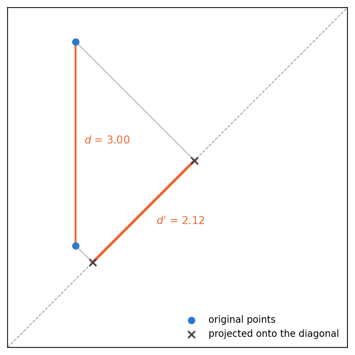
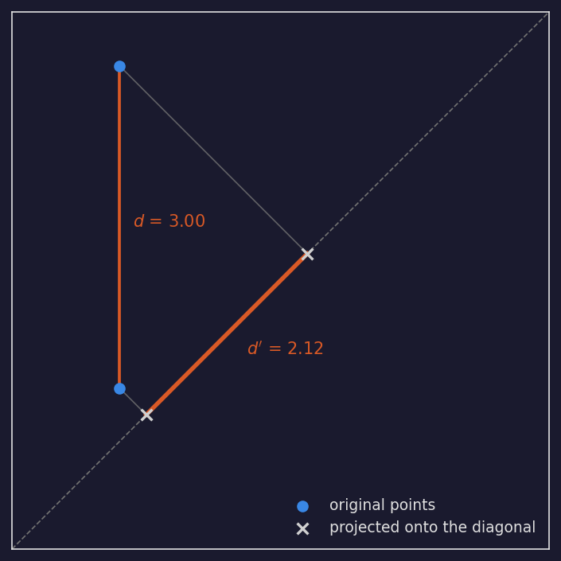
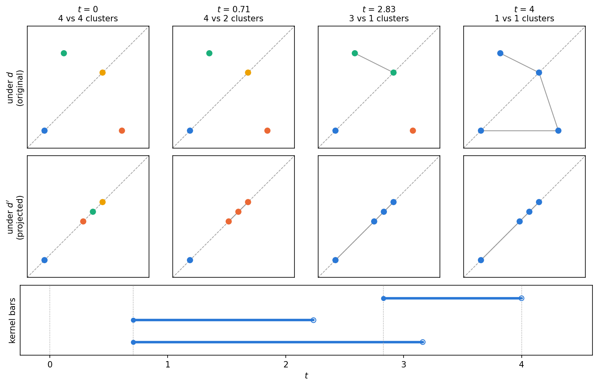
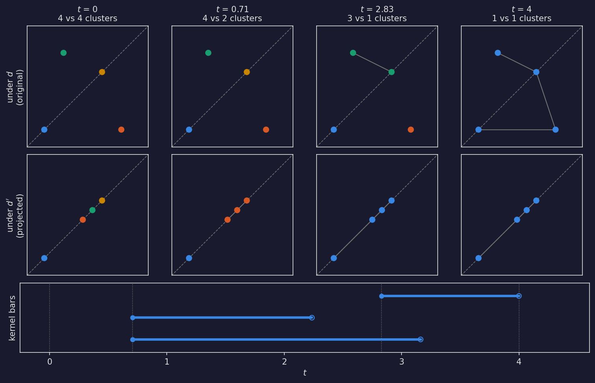
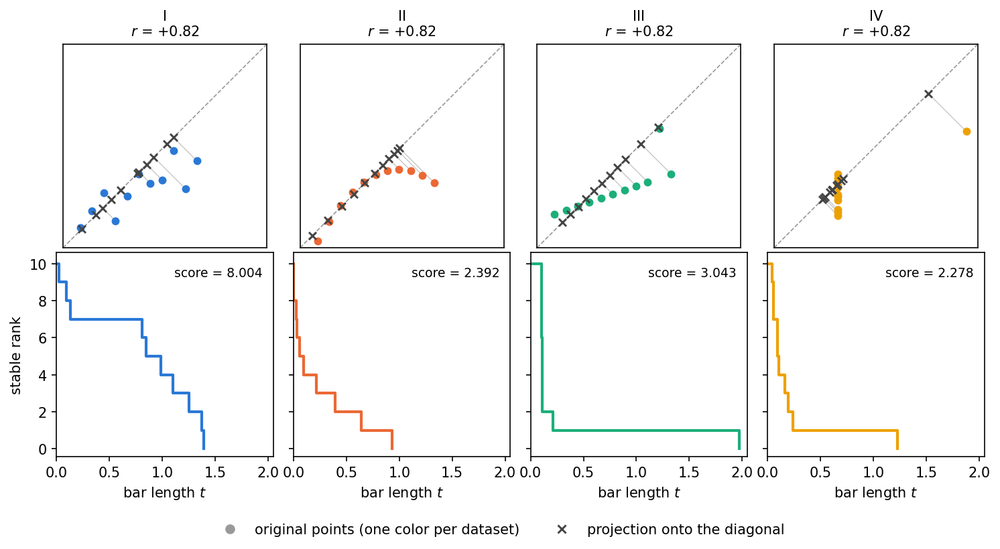
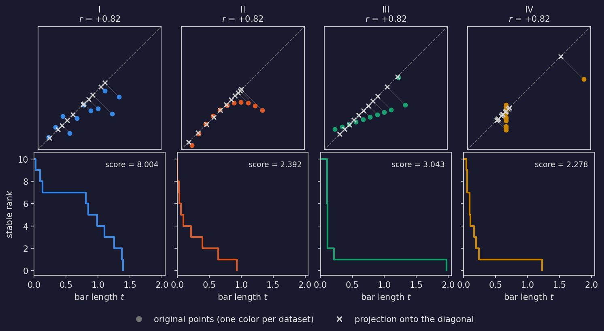
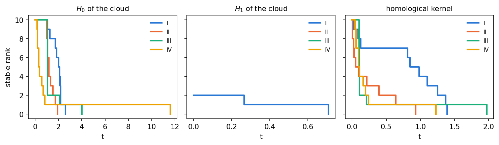
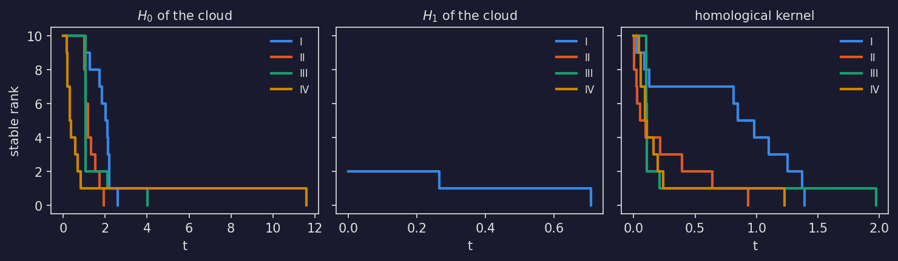

===================
Homological Kernels
===================

This guide covers the homological kernel in stablebear: what it computes, how
to prepare its paired inputs, and how to read the result. The computation
returns ordinary persistence barcodes, so everything downstream from the
barcode -- stable ranks, scores, distances, means -- is the standard pipeline
described in :doc:`persistence` and is not repeated here. Homological kernels
exist in every homology degree, but at the moment only the 0-th one
(``dim=0``) is computed. For the more mathematically inclined reader, the
precise definitions behind the method are collected in
:ref:`hkernel-mathematical-background` at the end of this guide.

Background
==========

The **homological kernel** compares two distances on the same set of points.
The input is a point set together with two distances :math:`d` and :math:`d'`
with :math:`d' \le d` everywhere -- for example, a point cloud with its
Euclidean distance, and a projection of the same cloud, which can only move
points closer together. Now grow a scale parameter :math:`t` from zero and
consider two points connected whenever their distance is at most :math:`t`
(the filtration scale of :doc:`persistence`). As :math:`t` grows, each
distance merges the points into larger and larger clusters, and since
:math:`d'` is the smaller distance, it merges them earlier. The homological
kernel records those disagreements.

The figure below shows the shrinking: both points drop onto the diagonal and
end up closer together than they started. The diagonal :math:`y = x` is not an arbitrary
choice -- this projection is what turns the homological kernel into a
**correlation method**: a standardized cloud of two perfectly positively
correlated variables already lies on the diagonal and is not moved at all, so
how much the projection shrinks the distances measures how far the data is
from that ideal. How this becomes a correlation score is developed below.

.. dropdown:: Show code
   :color: secondary

   .. literalinclude:: _static/gen_homological_kernel_figs.py
      :language: python
      :start-after: docs snippet start hkernel_projection --
      :end-before: docs snippet end hkernel_projection --

The output is a **persistence barcode** with one bar per merge: the bar is
born at the scale where two clusters merge under :math:`d'` and dies at the
scale where the same clusters merge under :math:`d`. Where the two distances
agree, the bars have length zero -- the more they disagree, the longer the
bars.

Watching a small cloud at a few growing scales makes this concrete. Points
within distance :math:`t` of each other are joined by an edge, and the
clusters are the connected components of the resulting graph; the grey edges
are the ones that cause the merges. At every
scale the projected points (bottom row) have merged into at least as few
clusters as the originals (middle row) -- the projection is always ahead. Each
bar in the resulting barcode spans exactly one of those leads, from the scale
where two clusters merge under :math:`d'` to the scale where the
same clusters merge under :math:`d`:

.. dropdown:: Show code
   :color: secondary

   .. literalinclude:: _static/gen_homological_kernel_figs.py
      :language: python
      :start-after: docs snippet start hkernel_merging --
      :end-before: docs snippet end hkernel_merging --

The main application of the homological kernel is as a **correlation
method**: pair two variables into a 2D point cloud, project that cloud onto
the diagonal :math:`y = x`, and measure how much the topology of the original
cloud differs from that of its projection. The
score measures deviation from a perfect positive linear relationship. A
standardized cloud with Pearson correlation :math:`+1` lies exactly on the
diagonal, so every bar has length zero, and for positively correlated linear
data the score moves closely with Pearson's :math:`r`. The two part ways
exactly where Pearson stops being informative: non-linear relationships and
clustering produce long bars that :math:`r` does not see, and negatively
correlated data -- linear or not -- lies far from the diagonal and scores
high. The total length of all bars is therefore a measure of non-positive
correlation, capturing dependence that a classical measure such as Pearson
correlation misses.

The method is not limited to projections: it accepts any two distances with
:math:`d' \le d`, on data of any dimension, either as point clouds compared
under the Euclidean metric or as precomputed distance matrices. The framework,
the algorithm, and its proof of correctness are developed in full in the
master's thesis :footcite:`KampNorthman2026`.

Ordinary persistent homology
(:py:func:`~stablebear.persistence.compute_persistent_homology`) describes the
shape of a *single* dataset -- its clusters and loops. The homological kernel
answers a different question: it compares *two* structures on the same points
and reports only where they disagree. The price is that you must construct the
second structure yourself -- stablebear does not do it for you. This framework
is highly flexible in practice, but constructing that second structure often
needs careful thought in cases other than the standard diagonal projection.

Computing the homological kernel
================================

:py:func:`~stablebear.persistence.compute_homological_kernel` takes two inputs
of the same kind and shape. ``X`` carries the larger distance :math:`d` and
``Y`` the smaller distance :math:`d'`; the requirement :math:`d' \le d` for
every pair of points is what makes the homological kernel well-defined, and
the computation raises a ``RuntimeError`` if it is violated. The result is a
:py:class:`~stablebear.persistence.BarcodeTensor` with one homological kernel
barcode per element; a pair on :math:`n` points always produces :math:`n - 1`
bars, one per merge in the clustering hierarchy. The ``dim`` parameter selects
the homology degree; only ``dim=0`` is currently supported.

Point clouds
------------

Point clouds always use the Euclidean metric. For the correlation use case,
``X`` is the cloud and ``Y`` is its projection onto the diagonal. An
orthogonal projection can only move points closer together, so
:math:`d' \le d` is guaranteed for any input. Keep point clouds in their
ambient dimension -- express a projection in the original coordinates rather
than dropping columns::

   import numpy as np
   from stablebear import persistence

   # A small 2D "correlation cloud"
   X = np.array([[0.0, 0.0], [4.0, 0.0], [0.0, 4.0], [3.0, 3.0]])

   # Its projection onto the diagonal: (x, y) -> ((x+y)/2, (x+y)/2)
   m = X.mean(axis=1, keepdims=True)
   Y = np.broadcast_to(m, X.shape).copy()

   bcs = persistence.compute_homological_kernel(X, Y)
   kernel = bcs[0]     # one Barcode, with len(X) - 1 = 3 bars

To process many pairs at once, store them in two ``PointCloudTensor``\ s.
Element ``i`` of ``X`` is paired with element ``i`` of ``Y``, and the pairs
are computed in parallel::

   import stablebear as sb

   clouds = sb.zeros((100,), dtype=sb.pcloud64)
   projected = sb.zeros((100,), dtype=sb.pcloud64)
   for i in range(100):
       cloud = np.random.randn(30, 2)
       clouds[i] = cloud
       projected[i] = np.broadcast_to(cloud.mean(axis=1, keepdims=True),
                                      cloud.shape).copy()

   kernels = persistence.compute_homological_kernel(clouds, projected)
   print(kernels.shape)   # (100,)

Distance matrices
-----------------

For any metric other than the Euclidean one, provide both inputs as
precomputed distance matrices with :math:`d' \le d` entrywise. For example,
take :math:`d` to be the shortest-path distance in a graph and :math:`d'` the
shortest-path distance in the same graph with an extra edge: adding an edge
can only shorten paths, so :math:`d' \le d` holds automatically -- the same
role the projection plays for point clouds. Here the graph is two two-point
clusters, ``{0, 1}`` and ``{2, 3}``, whose points sit at distance 1 within
each cluster, joined by a single bridge edge ``1 -- 2`` of length 5; the
extra edge is a shortcut ``0 -- 3`` of length 2::

   import stablebear as sb
   from stablebear import persistence

   # Shortest-path distances without and with the shortcut
   d_paths  = [(1, 0, 1.0), (2, 0, 6.0), (2, 1, 5.0),
               (3, 0, 7.0), (3, 1, 6.0), (3, 2, 1.0)]
   dp_paths = [(1, 0, 1.0), (2, 0, 3.0), (2, 1, 4.0),
               (3, 0, 2.0), (3, 1, 3.0), (3, 2, 1.0)]

   d  = sb.DistanceMatrix(4, dtype=sb.float64)
   dp = sb.DistanceMatrix(4, dtype=sb.float64)
   for (i, j, dij), (_, _, dpij) in zip(d_paths, dp_paths):
       d[i, j]  = dij
       dp[i, j] = dpij

   bcs = persistence.compute_homological_kernel(d, dp)

The homological kernel reports exactly what the shortcut changed: the two
within-cluster merges happen at scale 1 under both distances, giving two
zero-length bars,
while the merge of the two clusters happens at scale 2 under :math:`d'` (the
shortcut) but only at scale 5 under :math:`d` (the bridge) -- one bar
:math:`[2, 5)`.

Input flexibility
-----------------

Both ``X`` and ``Y`` accept the same forms as
:py:func:`~stablebear.persistence.compute_persistent_homology`:

- a plain NumPy array or ``FloatTensor`` (a single point cloud);
- a ``DistanceMatrix`` (a single precomputed metric);
- a ``PointCloudTensor`` or ``DistanceMatrixTensor`` (a whole tensor of them,
  computed in parallel).

``X`` and ``Y`` must be the same kind -- two point clouds or two distance
matrices, never one of each. A single-instance input returns a
``BarcodeTensor`` of shape ``(1,)``; a tensor input returns a barcode tensor
of the same shape.

From homological kernel barcode to correlation score
====================================================

Homological kernel barcodes are ordinary
:py:class:`~stablebear.persistence.Barcode` objects, so every functional
summary and tensor operation from :doc:`persistence` applies to them
unchanged. The summary used for the
correlation score is the **stable rank**, which here counts, for each
threshold :math:`t`, how many disagreements between the two distances exceed
:math:`t`. The score is the total length of all bars, obtained as the
:math:`L^1` norm of the stable rank::

   sranks = persistence.barcode_to_stable_rank(kernels)
   scores = sb.lp_norm(sranks, p=1)

A score of zero means every bar has length zero: the cloud and its projection
merge identically, i.e. the cloud already lies on the diagonal. Larger scores
mark stronger deviation from it. Comparing, averaging, or classifying whole
cohorts of homological kernels works exactly as for any other barcode
tensor -- see :doc:`persistence`.

A worked example: Anscombe's quartet
====================================

Anscombe's quartet :footcite:`Anscombe1973` is four small datasets that
share, to two decimals, the
same mean, the same variance, the same Pearson correlation (:math:`r` = +0.82)
and the same regression line, yet look quite different. It is a standard
demonstration that summary statistics can miss what a plot shows immediately.

The whole computation -- project onto the diagonal, compute the homological
kernel, summarize as a stable rank, integrate to a score -- fits in a dozen
lines:

.. literalinclude:: _static/gen_homological_kernel_figs.py
   :language: python
   :start-after: docs snippet start hkernel_quartet_kernel --
   :end-before: docs snippet end hkernel_quartet_kernel --

Applied to each dataset of the quartet:

.. dropdown:: Show code
   :color: secondary

   .. literalinclude:: _static/gen_homological_kernel_figs.py
      :language: python
      :start-after: docs snippet start hkernel_quartet --
      :end-before: docs snippet end hkernel_quartet --

The top row shows each cloud, the diagonal it is projected onto, and a grey
segment joining every point to where it lands. Underneath each cloud is the
stable rank of its homological kernel, with the score -- the area under the
curve -- annotated. Pearson's :math:`r` is identical across all four; the
four curves are not remotely alike.

Reading the curves
------------------

- **The height at** :math:`t = 0` **is the number of disagreements.** All four
  datasets sit at 10 -- with 11 points there are always 10 merges, and in each
  dataset every one of them disagrees at least slightly. What separates the
  datasets is not the count but *how large* the disagreements are, which is
  the rest of the curve.
- **A curve that drops to zero immediately means the cloud lies on the
  diagonal.** Ten bars of length zero give a stable rank that is 0 everywhere,
  area included.

Three things to keep in mind when comparing scores or curves:

- **The diagonal is** :math:`y = x`, **not the regression line.** Strongly
  anti-correlated data is far from it and therefore scores *high*. The
  homological kernel measures alignment with the diagonal, not the strength
  of a relationship in either direction.
- **Scores grow with the number of points.** A cloud of :math:`n` points
  always produces :math:`n - 1` bars, so for the same shape a larger cloud
  scores higher -- just as :math:`H_0` and :math:`H_1` stable ranks grow with
  the size of the cloud.
- **Centering does not change the result, rescaling does.** The homological
  kernel depends only on distances, so translating a cloud changes nothing.
  Dividing each
  variable by its standard deviation, on the other hand, is a real modelling
  choice that changes both the scores and their order. Decide once, then apply
  it to everything you intend to compare.

The score is a summary of the curve, not the other way around. Datasets II and
IV score 2.392 and 2.278 -- within 5% of each other despite looking quite
different -- because collapsing a curve into a scalar can flatten two different
geometries into the same total. Their bar lengths, sorted longest first, show
what the two numbers hide:

.. list-table::
   :header-rows: 1

   * - dataset
     - bar lengths
     - score
   * - II
     - 0.933, 0.642, 0.393, 0.215, then six under 0.1
     - 2.392
   * - IV
     - 1.227, then nine under 0.25
     - 2.278

Dataset II spreads its disagreements over a range of sizes; dataset IV has one
large disagreement and nine negligible ones. The scores barely distinguish
them, but the curves plainly do -- and the curve is what the homological
kernel produced, so comparing curves costs nothing extra.

Comparison with ordinary persistent homology
============================================

How does this compare with the plain persistent homology of each cloud?
Computing :math:`H_0` and :math:`H_1` of each dataset, next to the
homological kernel, gives three quite different pictures:

.. dropdown:: Show code
   :color: secondary

   .. literalinclude:: _static/gen_homological_kernel_figs.py
      :language: python
      :start-after: docs snippet start hkernel_invariants --
      :end-before: docs snippet end hkernel_invariants --

For the quartet, :math:`H_0` separates the four datasets as well -- but it
measures something else: how the points cluster in the plane. Its long tail
for dataset IV is that dataset's distant outlier, which would look the same
whatever the relationship between the two variables. :math:`H_1` is nearly
silent -- only dataset I has any loops at all. The other three appear in the
middle panel's legend but have no visible curve, because their :math:`H_1`
barcodes are empty and their stable ranks are flat at zero. Eleven points
rarely enclose a hole.

There is also a reason of principle that a plain barcode -- however it is
summarized -- cannot measure correlation. :math:`H_0` and :math:`H_1` depend
only on the distances between points, and rotating a cloud changes no
distance while changing its correlation completely. Rotating dataset I by
90° about its center::

   import numpy as np

   angle = np.deg2rad(90)
   R = np.array([[np.cos(angle), -np.sin(angle)],
                 [np.sin(angle), np.cos(angle)]])
   rotated = np.ascontiguousarray((cloud - cloud.mean(0)) @ R.T + cloud.mean(0))

flips Pearson's :math:`r` from :math:`+0.82` to :math:`-0.82`:

.. list-table::
   :header-rows: 1

   * - rotation
     - Pearson :math:`r`
     - :math:`H_0`
     - :math:`H_1`
     - homological kernel score
   * - 0°
     - +0.82
     - 19.105
     - 0.973
     - 8.004
   * - 90°
     - -0.82
     - 19.105
     - 0.973
     - 14.396

The two homology columns cannot tell the rotated cloud from the original --
and no quantity computed from the cloud's distances alone can, whatever
summary is applied to it. The homological kernel score does move, because
the diagonal stays fixed while the data turns relative to it. That fixed
second structure is what a single barcode lacks, and supplying it is what
the homological kernel provides.

.. _hkernel-mathematical-background:

Mathematical background
=======================

This section makes precise what the bars mean, and why the object they come
from is called a *kernel*. It is not needed in order to use the method. In
plain terms: as the scale grows, both distances merge the same points into
clusters, but the finer distance :math:`d'` merges them earlier. Each bar
records one disagreement -- it is born when two clusters merge under
:math:`d'` and dies when the same clusters finally merge under :math:`d`.

Formally, the identity map :math:`(X, d) \to (X, d')` is 1-Lipschitz because
:math:`d' \le d`. It therefore induces a map between the Vietoris-Rips
filtrations and, after applying the 0-th homology functor, a map of
persistence modules

.. math::

   \mu \colon H_0(\mathrm{VR}(X, d)) \longrightarrow H_0(\mathrm{VR}(X, d')) .

At every scale :math:`t`, the finer distance :math:`d'` has already connected
at least as many points as :math:`d`, so :math:`\mu_t` is surjective: it sends
each :math:`d`-component to the :math:`d'`-component that contains it. It is
generally not injective -- two points can be joined under :math:`d'` while
still separate under :math:`d`. The **0-th homological kernel** is the kernel
of this map,

.. math::

   \ker \mu = \ker\bigl( H_0(\mathrm{VR}(X, d)) \to H_0(\mathrm{VR}(X, d')) \bigr) ,

a persistence module that decomposes into a barcode
:math:`\bigoplus_i [w_i, v_i)`. Each bar tracks one component that is
identified early under :math:`d'` but stays separate longer under :math:`d`:

- the **birth** :math:`w_i` is the scale at which two components merge under
  the finer distance :math:`d'` -- the moment the discrepancy appears,
- the **death** :math:`v_i` is the scale at which those same components merge
  under the coarse distance :math:`d` -- the moment the discrepancy is
  resolved.

Since :math:`d' \le d`, every death is at least its birth, so all bars are
well-formed. A **zero-length bar** :math:`[w_i, w_i)` means the two distances
merge those components at the very same scale. Long
bars mark where the two structures diverge. A set of :math:`n`
points always produces :math:`n - 1` bars, one per merge in the hierarchy.

Under the hood, the homological kernel is computed from two minimum spanning
trees and a union-find sweep -- :math:`O(n^2)` time and :math:`O(n)` memory
per instance,
with no distance matrix ever materialized for point clouds. The algorithm and
its proof of correctness are derived in full in the thesis
:footcite:`KampNorthman2026`.

References
==========

.. footbibliography::
