========
Plotting
========

The :py:func:`~masspcf.plotting.plot` function provides a quick way to visualize PCFs using matplotlib.

A single PCF
============

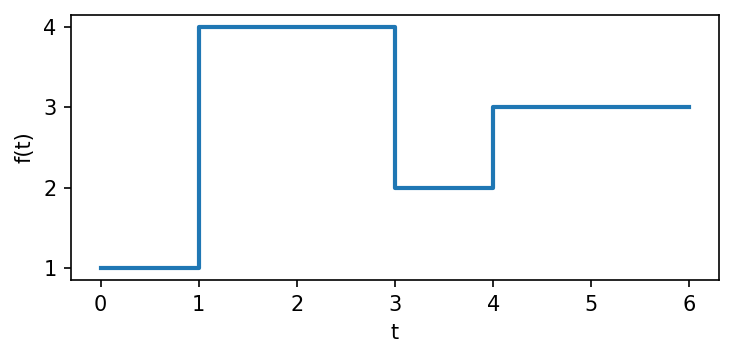

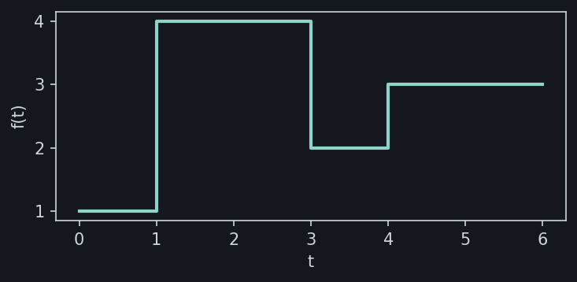

.. dropdown:: Show code
   :color: secondary

   .. literalinclude:: _static/gen_plotting_gallery.py
      :language: python
      :start-after: docs snippet start single_pcf --
      :end-before: docs snippet end single_pcf --

Overlaying many PCFs
====================

Pass a 1-D tensor to plot all elements at once. Use ``alpha`` to see overlapping
regions:

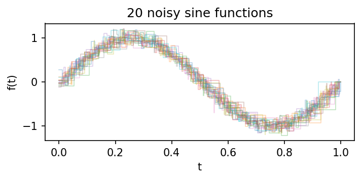

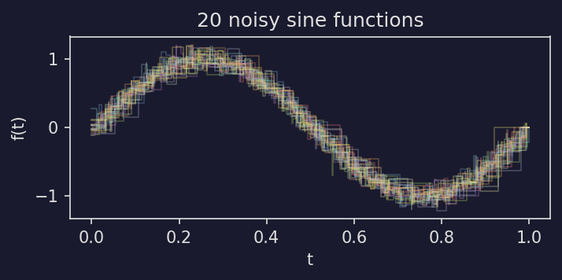

.. dropdown:: Show code
   :color: secondary

   .. literalinclude:: _static/gen_plotting_gallery.py
      :language: python
      :start-after: docs snippet start overlaid --
      :end-before: docs snippet end overlaid --

PCF arithmetic
==============

Since PCFs support pointwise arithmetic, you can visualize the result of operations
like addition:

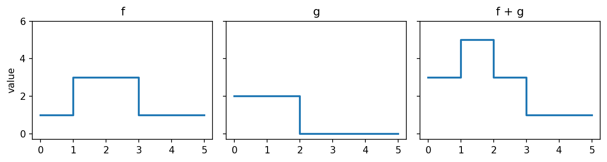

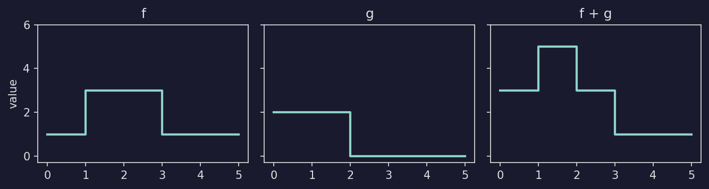

.. dropdown:: Show code
   :color: secondary

   .. literalinclude:: _static/gen_plotting_gallery.py
      :language: python
      :start-after: docs snippet start arithmetic --
      :end-before: docs snippet end arithmetic --

Highlighting the mean
=====================

A common pattern is to plot individual noisy functions in the background with
their mean highlighted in the foreground:

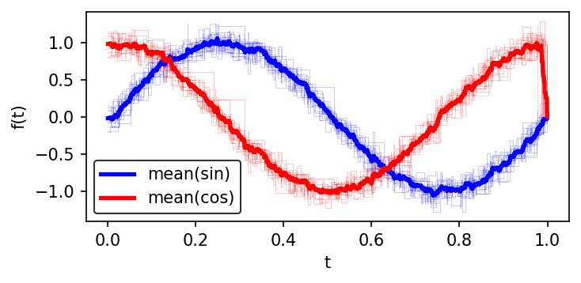

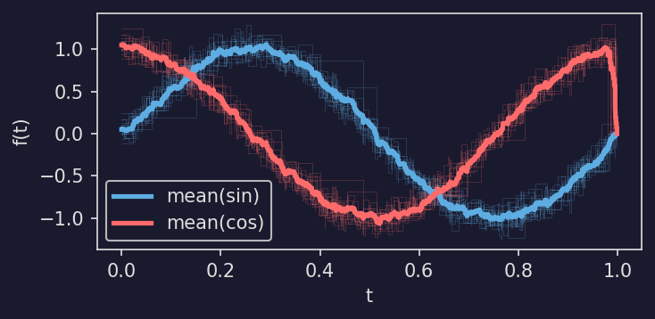

.. dropdown:: Show code
   :color: secondary

   .. literalinclude:: _static/gen_plotting_gallery.py
      :language: python
      :start-after: docs snippet start mean_highlight --
      :end-before: docs snippet end mean_highlight --

Persistence barcodes
====================

Use :py:func:`~masspcf.plotting.plot_barcode` to visualize persistence barcodes
as horizontal line segments. Each bar runs from its birth to its death value.
Bars with infinite death are drawn as arrows extending to the right edge of the
plot.

Stack multiple homology dimensions by passing ``y_offset``:

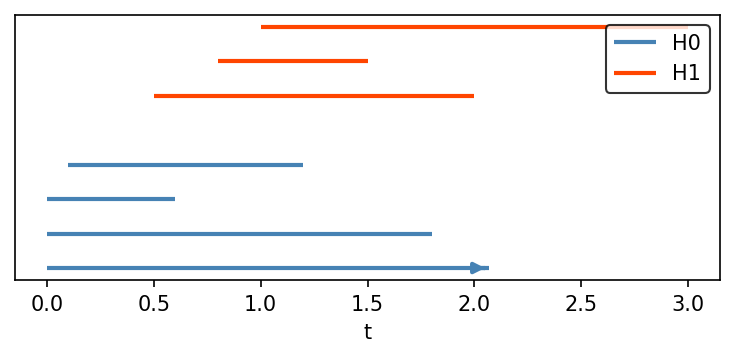

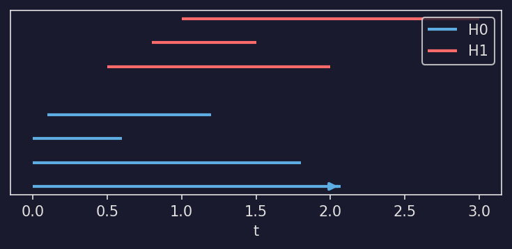

.. dropdown:: Show code
   :color: secondary

   .. literalinclude:: _static/gen_plotting_gallery.py
      :language: python
      :start-after: docs snippet start barcode --
      :end-before: docs snippet end barcode --

TDA pipeline
=============

A complete example: generate a random point cloud, compute its persistent
homology, and plot the persistence diagram (via `persim <https://persim.scikit-tda.org/>`_)
alongside the stable rank:

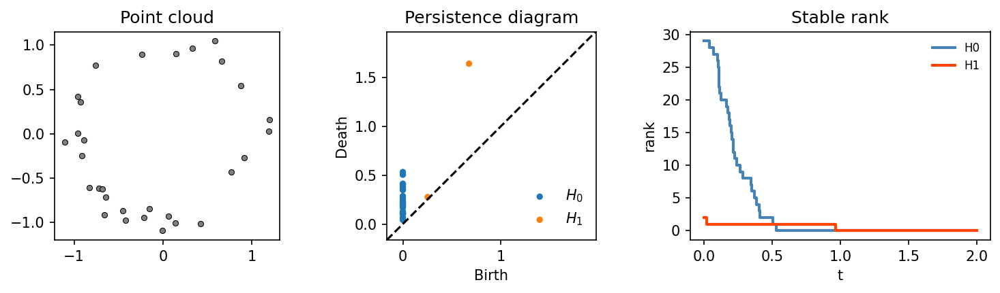

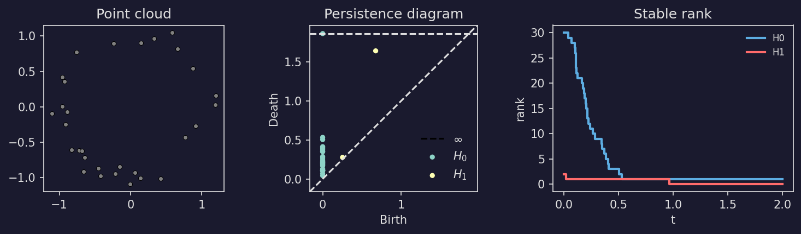

.. dropdown:: Show code
   :color: secondary

   .. literalinclude:: _static/gen_plotting_gallery.py
      :language: python
      :start-after: docs snippet start tda_pipeline --
      :end-before: docs snippet end tda_pipeline --

Betti curve pipeline
====================

The same pipeline using a barcode plot and Betti curves:

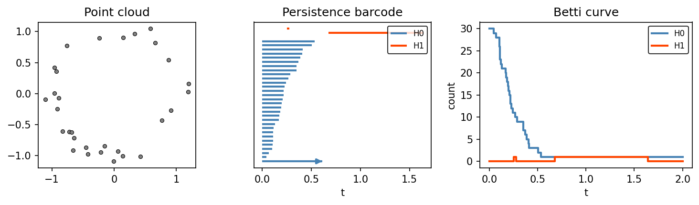

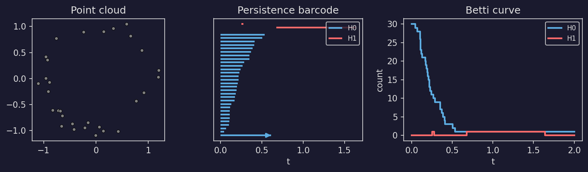

.. dropdown:: Show code
   :color: secondary

   .. literalinclude:: _static/gen_plotting_gallery.py
      :language: python
      :start-after: docs snippet start betti_pipeline --
      :end-before: docs snippet end betti_pipeline --

max_time
========

By default, a single PCF is plotted only up to its last breakpoint. Pass ``max_time`` to extend the final constant segment::

   f = mpcf.Pcf([[0, 1], [2, 3]])
   plotpcf(f, ax=ax, max_time=5)  # extends the plot to t=5

When plotting a 1-D tensor, all elements are automatically extended to the latest breakpoint across the tensor. Passing ``max_time`` overrides this with a custom value.

Styling
=======

The ``plot`` function accepts any keyword arguments that matplotlib's ``step`` function does (``color``, ``linewidth``, ``alpha``, ``label``, etc.). When plotting a 1-D tensor with ``auto_label=True``, each PCF is automatically labeled as ``f0``, ``f1``, etc.
