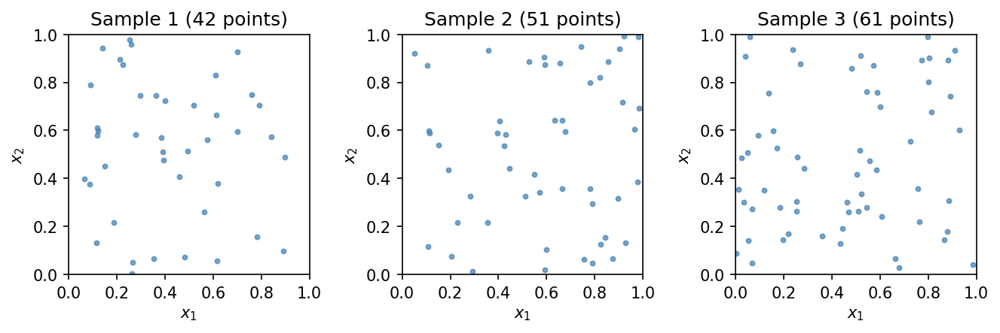
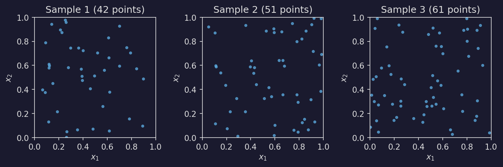

===============
Point Processes
===============

The :py:mod:`masspcf.point_process` module provides samplers for spatial point
processes, returning :py:class:`~masspcf.tensor.PointCloudTensor` objects. All
samplers support deterministic seeding via :py:class:`~masspcf.random.Generator`
(see :doc:`random`).

Poisson point process
=====================

:py:func:`~masspcf.point_process.sample_poisson` generates point clouds from a
homogeneous spatial Poisson process. Each element of the output tensor is a
point cloud with a random number of points:

.. math::

   N \sim \text{Poisson}(\lambda \cdot V)

where :math:`\lambda` is the rate (intensity) and :math:`V` is the volume of
the sampling region. Points are placed uniformly in the region.

.. dropdown:: Show code
   :color: secondary

   .. literalinclude:: _static/gen_plotting_gallery.py
      :language: python
      :start-after: docs snippet start poisson_samples --
      :end-before: docs snippet end poisson_samples --

Basic usage::

   from masspcf.point_process import sample_poisson

   # 100 point clouds in R^2, rate 50, in the unit square
   X = sample_poisson((100,), dim=2, rate=50.0)

   # 3-D point clouds in a custom box, seeded for reproducibility
   import masspcf as mpcf
   gen = mpcf.random.Generator(seed=42)

   X = sample_poisson(
       (10, 20),
       dim=3,
       rate=100.0,
       lo=[0.0, 0.0, -1.0],
       hi=[1.0, 2.0, 1.0],
       generator=gen,
   )

By default the sampling region is :math:`[0, 1]^d`. Custom bounds are specified
with ``lo`` and ``hi``, each an array of length ``dim``.
