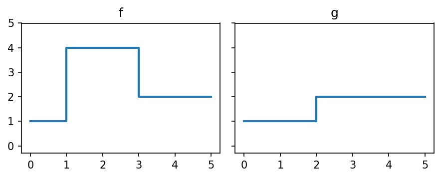
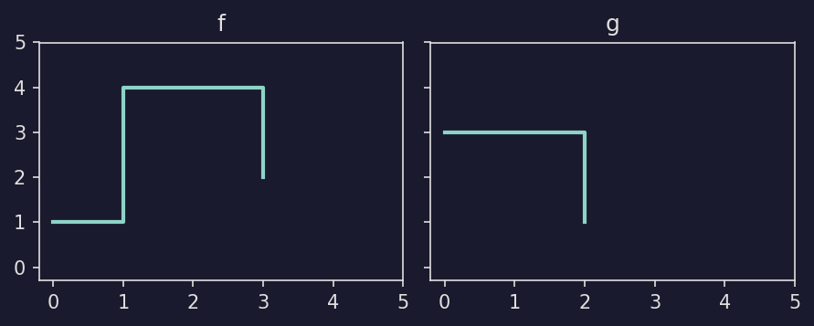
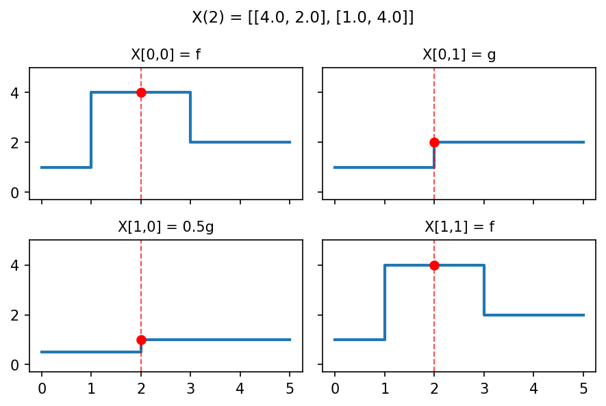
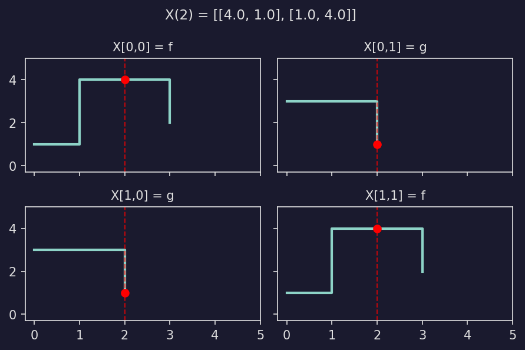
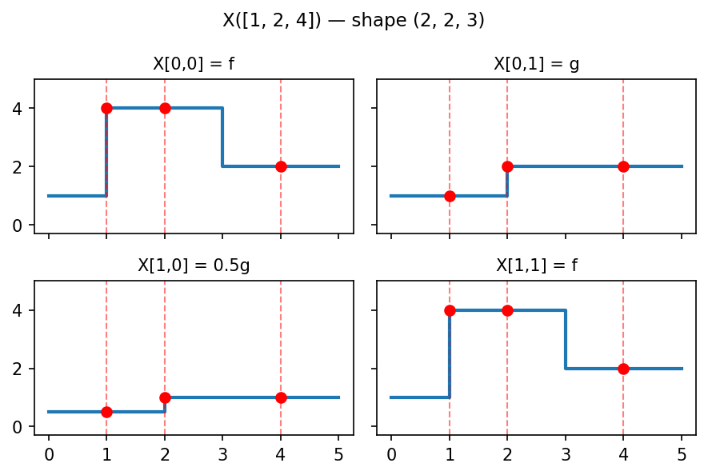
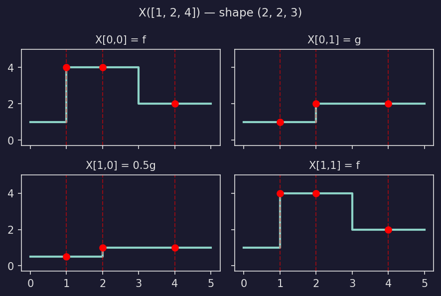
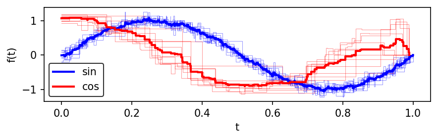
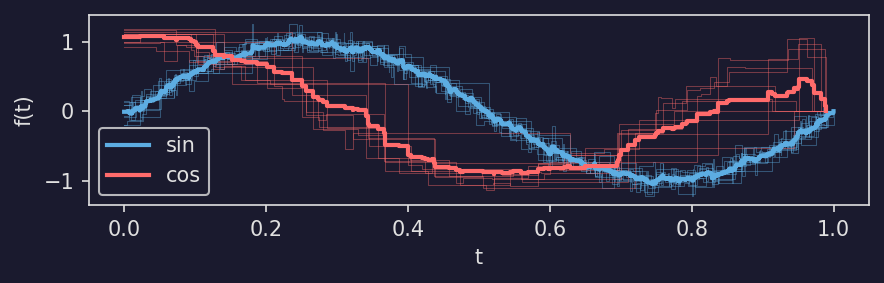

======================
Working with Tensors
======================

This guide covers the practical details of creating, manipulating, and persisting tensors in masspcf.

Creating tensors
================

Using zeros
-----------

The most common way to create a tensor is :py:func:`~masspcf.zeros`, which allocates a tensor of a given shape filled with "zero" elements::

   import masspcf as mpcf

   # 1-D tensor of 100 PCFs (32-bit, the default)
   X = mpcf.zeros((100,))

   # 3-D tensor of 64-bit PCFs
   Y = mpcf.zeros((4, 10, 25), dtype=mpcf.pcf64)

   # Scalar float tensor
   Z = mpcf.zeros((5, 5), dtype=mpcf.float64)

For PCF dtypes, "zero" is a function that is identically zero. For numeric dtypes, it is the number 0. For point cloud dtypes, it is an empty point cloud.

Generating random data
-----------------------

For quick experimentation, :py:mod:`masspcf.random` provides functions that generate tensors of noisy trigonometric PCFs::

   from masspcf.random import noisy_sin, noisy_cos

   # 200 noisy sin(2*pi*t) functions, each with 100 breakpoints
   sines = noisy_sin((200,), n_points=100)

   # 2-D: 10 x 50 noisy cosine functions with 30 breakpoints each
   cosines = noisy_cos((10, 50), n_points=30)

These functions return ``Pcf32Tensor`` by default. Pass ``dtype=mpcf.pcf64`` for 64-bit.

From serialized NumPy data
---------------------------

:py:func:`~masspcf.from_serial_content` constructs a tensor from PCF data already stored in NumPy arrays — a flat content array and an enumeration array that describes how to split it::

   import numpy as np
   import masspcf as mpcf

   # Three PCFs packed into a single content array
   content = np.array([
       [0.0, 2.5], [1.5, 1.2], [3.14, 0.0],   # PCF 0 (3 points)
       [0.0, 7.0], [3.8, 5.5], [4.5, 1.5], [7.0, 0.0],  # PCF 1 (4 points)
       [0.0, 3.0], [2.0, 0.0],                   # PCF 2 (2 points)
   ])

   # Each row gives (start, end) indices into content
   enumeration = np.array([[0, 3], [3, 7], [7, 9]])

   F = mpcf.from_serial_content(content, enumeration)
   # F is a Pcf32Tensor of shape (3,)

The enumeration array can be multidimensional. If it has shape ``(n1, n2, ..., nk, 2)``, the resulting tensor has shape ``(n1, n2, ..., nk)``.

Indexing and slicing
====================

Tensors support NumPy-style indexing. The behavior depends on whether the index uses integers or slices.

Single-element access
---------------------

Indexing with all integers returns the element at that position::

   X = mpcf.zeros((10, 5))
   f = X[3, 2]   # returns a Pcf object

For a ``Pcf32Tensor`` or ``Pcf64Tensor``, the returned element is a :py:class:`~masspcf.Pcf`. For a ``Float32Tensor``, it is a Python float. For a ``PointCloud32Tensor``, it is a ``Float32Tensor`` (representing the point cloud as a numeric array).

Slicing
-------

Using slices returns a tensor (view)::

   X = mpcf.zeros((10, 5, 4))

   row = X[3, :, :]          # shape (5, 4)
   sub = X[2:8, 1:, 2]       # shape (6, 4)
   every_other = X[::2, :, :]  # shape (5, 5, 4)

Views share the underlying data with the original tensor, so no data is copied.

Assignment
----------

Tensors support assignment with the same indexing syntax::

   from masspcf.random import noisy_sin, noisy_cos

   A = mpcf.zeros((2, 10))

   # Assign noisy sin functions into the first row
   A[0, :] = noisy_sin((10,), n_points=100)

   # Assign noisy cos functions into the second row
   A[1, :] = noisy_cos((10,), n_points=15)

Individual elements can also be assigned::

   f = mpcf.Pcf([[0, 1.0], [1, 2.0], [3, 0.0]])
   A[0, 0] = f

Shape and copying
-----------------

Every tensor has a :py:attr:`shape` property::

   X = mpcf.zeros((10, 5, 4))
   X.shape        # (10, 5, 4)
   X[3, :, :].shape  # (5, 4)

To create an independent copy (not a view)::

   Y = X.copy()

To collapse all dimensions into one::

   flat = X.flatten()  # shape (200,)

Arithmetic
==========

Numeric and PCF tensors support the standard arithmetic operators ``+``, ``-``,
``*``, ``/``, ``**``, unary ``-``, and their in-place counterparts ``+=``,
``-=``, ``*=``, ``/=``, ``**=``.

Scalar arithmetic
-----------------

Every operator accepts a scalar on either side::

   X = mpcf.Float64Tensor(np.array([1.0, 2.0, 3.0]))

   Y = X * 2.0      # [2.0, 4.0, 6.0]
   Z = 10.0 + X     # [11.0, 12.0, 13.0]
   W = 10.0 / X     # [10.0, 5.0, 3.33...]
   X /= 5.0         # in-place: [0.2, 0.4, 0.6]

PCF tensors support all four operators with both ``Pcf`` operands (pointwise)
and numeric scalars. Scalar ``+`` and ``-`` shift the values, while ``*`` and
``/`` scale them::

   X = mpcf.zeros((5,))
   # ... fill X with PCFs ...
   X * 3.0           # scale values
   X + 10.0          # shift values up
   1.0 / X           # elementwise reciprocal
   -X                # negate
   X + some_pcf      # pointwise PCF addition

Power
-----

The ``**`` operator raises every element to a given exponent. It works for both
numeric and PCF tensors::

   X = mpcf.Float64Tensor(np.array([4.0, 9.0, 16.0]))
   Y = X ** 0.5       # [2.0, 3.0, 4.0]
   X **= 2            # in-place: [16.0, 81.0, 256.0]

   F = mpcf.zeros((5,))
   # ... fill F with PCFs ...
   G = F ** 2          # square every PCF's values
   F **= 3             # cube in place

A ``RuntimeWarning`` is emitted if the result contains NaN or infinity (e.g.
raising a negative value to a fractional power).

Tensor-tensor arithmetic (broadcasting)
----------------------------------------

When both operands are tensors of the same type, elementwise arithmetic is
performed with `NumPy-style broadcasting
<https://numpy.org/doc/stable/user/basics.broadcasting.html>`_:

- Shapes are compared dimension-by-dimension from the right.
- Dimensions match if they are equal, or one of them is 1.
- A missing leading dimension is treated as size 1.

::

   import numpy as np
   import masspcf as mpcf

   A = mpcf.Float64Tensor(np.array([[1.0, 2.0, 3.0],
                                     [4.0, 5.0, 6.0]]))    # shape (2, 3)
   B = mpcf.Float64Tensor(np.array([10.0, 20.0, 30.0]))    # shape (3,)

   C = A + B   # shape (2, 3) — B is broadcast along dim 0
   # C == [[11, 22, 33],
   #       [14, 25, 36]]

Both operands can be expanded at the same time::

   col = mpcf.Float64Tensor(np.array([[1.0], [2.0]]))       # shape (2, 1)
   row = mpcf.Float64Tensor(np.array([[10.0, 20.0, 30.0]])) # shape (1, 3)

   result = col + row   # shape (2, 3)
   # result == [[11, 21, 31],
   #            [12, 22, 32]]

In-place operators (``+=``, ``-=``, ``*=``, ``/=``) broadcast the right-hand
side but never expand the left-hand side — the output shape must equal the
shape of the left operand, just like NumPy::

   A += B          # OK:  (2,3) + (3,) -> (2,3) matches A
   # B += A        # ValueError: (3,) + (2,3) -> (2,3) != (3,)

Incompatible shapes raise ``ValueError``::

   X = mpcf.Float64Tensor(np.array([1.0, 2.0, 3.0]))
   Y = mpcf.Float64Tensor(np.array([1.0, 2.0]))
   # X + Y  -> ValueError: shapes (3,) and (2,) are not broadcast-compatible

Broadcasting also works with PCF tensors::

   F = mpcf.zeros((4, 10))
   # ... fill F with PCFs ...

   bias = mpcf.zeros((10,))
   # ... fill bias ...

   adjusted = F + bias  # shape (4, 10) — bias broadcast along dim 0

broadcast_to
------------

For advanced use, :py:meth:`~masspcf._tensor_base.Tensor.broadcast_to` returns
a view of a tensor as if it had the given shape. Size-1 dimensions are
virtually repeated without copying data::

   X = mpcf.Float64Tensor(np.array([1.0, 2.0, 3.0]))   # shape (3,)
   view = X.broadcast_to((4, 3))                         # shape (4, 3)
   # Every row of view is [1, 2, 3]; view shares data with X

Comparisons
===========

Tensors support the comparison operators ``==``, ``!=``, ``<``, ``<=``, ``>``,
and ``>=``. Each returns a :py:class:`~masspcf.BoolTensor` containing the
element-wise result, just like NumPy::

   import numpy as np
   import masspcf as mpcf

   A = mpcf.Float64Tensor(np.array([1.0, 2.0, 3.0]))
   B = mpcf.Float64Tensor(np.array([1.0, 9.0, 3.0]))

   result = A == B   # BoolTensor: [True, False, True]
   result = A < B    # BoolTensor: [False, True, False]

Broadcasting
------------

Comparisons follow the same broadcasting rules as arithmetic. Shapes are
compared dimension-by-dimension from the right, and size-1 or missing
dimensions are expanded::

   A = mpcf.Float64Tensor(np.array([[1.0, 2.0],
                                     [3.0, 4.0]]))   # shape (2, 2)
   B = mpcf.Float64Tensor(np.array([1.0, 4.0]))      # shape (2,)

   result = A == B
   # BoolTensor of shape (2, 2):
   # [[True,  False],
   #  [False, True]]

Column and scalar broadcasting also work::

   col = mpcf.Float64Tensor(np.array([[2.0], [3.0]]))  # shape (2, 1)
   result = A < col
   # BoolTensor of shape (2, 2):
   # [[True, False],
   #  [False, False]]

   scalar = mpcf.Float64Tensor(np.array([2.0]))        # shape (1,)
   result = A >= scalar
   # BoolTensor of shape (2, 2):
   # [[False, True],
   #  [True,  True]]

Converting to Python bool
-------------------------

Calling ``bool()`` on a single-element ``BoolTensor`` returns a Python ``bool``.
For multi-element tensors, ``bool()`` raises ``ValueError``, matching NumPy's
behavior::

   A = mpcf.Float64Tensor(np.array([1.0]))
   B = mpcf.Float64Tensor(np.array([1.0]))
   bool(A == B)   # True

   C = mpcf.Float64Tensor(np.array([1.0, 2.0]))
   D = mpcf.Float64Tensor(np.array([1.0, 2.0]))
   bool(C == D)   # ValueError: more than one element

array_equal
-----------

To check whether two tensors are entirely equal (as a single ``bool``), use
:py:meth:`~masspcf._tensor_base.Tensor.array_equal`::

   A = mpcf.Float64Tensor(np.array([1.0, 2.0, 3.0]))
   B = A.copy()

   A.array_equal(B)   # True
   A.array_equal(np.array([1.0, 2.0, 3.0]))  # also accepts NumPy arrays

   C = mpcf.Float64Tensor(np.array([1.0, 9.0, 3.0]))
   A.array_equal(C)   # False

Tensors with different shapes always compare as not equal.

PCF comparisons
---------------

Comparison operators also work on PCF tensors. Two PCFs are equal if they have
the same breakpoints and values::

   F = mpcf.random.noisy_sin((3,))
   G = F.copy()

   result = F == G    # BoolTensor: [True, True, True]
   F.array_equal(G)   # True

Boolean masking
===============

A ``BoolTensor`` can be used as an index to select elements where the mask is
``True``. Comparison operators return ``BoolTensor`` objects, so the result of
a comparison can be used directly as a mask.

Full-shape masking
------------------

When a ``BoolTensor`` has the same shape as the tensor it indexes, the result
is a flat 1-D tensor of the elements where the mask is ``True``::

   import numpy as np

   X = mpcf.Float32Tensor(np.array([[1, 2, 3],
                                     [4, 5, 6]], dtype=np.float32))
   mask = mpcf.BoolTensor(np.array([[True,  False, True],
                                     [False, True,  False]]))

   X[mask]   # Float32Tensor: [1, 3, 5]

This behaves the same as NumPy::

   arr = np.array([[1, 2, 3], [4, 5, 6]])
   arr[np.array([[True, False, True], [False, True, False]])]
   # array([1, 3, 5])

Assignment with a full-shape mask is also supported::

   X[mask] = 0.0          # scalar fill: set masked positions to 0
   X[mask] = some_tensor   # tensor assign: must have the right number of elements

Axis masking
------------

A 1-D ``BoolTensor`` can be used at a specific axis position alongside slices
and integer indices. This selects along that axis where the mask is ``True``,
preserving other dimensions::

   X = mpcf.Float32Tensor(np.arange(12, dtype=np.float32).reshape(3, 4))

   col_mask = mpcf.BoolTensor(np.array([True, False, True, False]))
   X[:, col_mask]       # shape (3, 2) — selects columns 0 and 2

   row_mask = mpcf.BoolTensor(np.array([False, True, True]))
   X[row_mask, :]       # shape (2, 4) — selects rows 1 and 2

This works with slices too::

   Y = mpcf.Float32Tensor(np.arange(60, dtype=np.float32).reshape(3, 4, 5))

   mask = mpcf.BoolTensor(np.array([True, False, True, False]))
   Y[:, mask, 1:4]      # shape (3, 2, 3)

Creating BoolTensors
--------------------

``BoolTensor`` can be created from NumPy arrays or from comparison operators::

   # From a NumPy array
   mask = mpcf.BoolTensor(np.array([True, False, True]))

   # From a comparison
   X = mpcf.Float32Tensor(np.array([1, 2, 3, 4, 5], dtype=np.float32))
   threshold = mpcf.Float32Tensor(np.full(5, 3.0, dtype=np.float32))
   mask = X > threshold   # BoolTensor: [False, False, False, True, True]

.. _masking-numpy-differences:

Differences from NumPy
----------------------

Axis masking follows **outer indexing** semantics: each index independently
selects along its own axis. This matches what most users expect and is the
behavior described in `NEP 21 <https://numpy.org/neps/nep-0021-advanced-indexing.html>`_.

In practice, the only case where this differs from NumPy is when an integer
index and a boolean mask appear in the same indexing expression. Consider a
3-D tensor ``X`` of shape ``(2, 3, 4)`` and a boolean mask of length 4:

- ``X[0, :, mask]`` first selects index 0 along the first axis (giving a
  ``(3, 4)`` result), then applies the mask along the last axis.
- In NumPy, ``arr[0, :, mask]`` instead reorders dimensions so that the mask
  axis comes first, giving a different shape.

masspcf applies indices left-to-right without reordering.

For expressions that only use slices and masks (the common case), masspcf and
NumPy produce identical results.

Evaluation
==========

PCF tensors are callable — every element can be evaluated at one or more times
in a single call.

Consider a small example with two PCFs::

   import numpy as np
   import masspcf as mpcf

   # f(t) = 1 on [0,1), 4 on [1,3), 2 on [3,inf)
   f = mpcf.Pcf(np.array([[0, 1], [1, 4], [3, 2]], dtype=np.float32))

   # g(t) = 1 on [0,2), 2 on [2,inf)
   g = mpcf.Pcf(np.array([[0, 1], [2, 2]], dtype=np.float32))

.. dropdown:: Show plotting code
   :color: secondary

   .. literalinclude:: _static/gen_tensor_eval_fig.py
      :pyobject: plot_pcf_definitions
      :language: python

Arrange them in a 2x2 tensor::

   X = mpcf.zeros((2, 2))
   X[0, 0] = f
   X[0, 1] = g
   X[1, 0] = 0.5 * g
   X[1, 1] = f

Scalar evaluation
-----------------

Pass a single number to get one value per PCF. The result is a NumPy array
with the same shape as the tensor::

   X(2)
   # array([[4., 2.],
   #        [1., 4.]], dtype=float32)

.. dropdown:: Show plotting code
   :color: secondary

   .. literalinclude:: _static/gen_tensor_eval_fig.py
      :pyobject: plot_tensor_eval_example
      :language: python

Array evaluation
----------------

Pass an array of times to evaluate every PCF at every time. The time
dimensions are appended to the tensor shape::

   times = np.array([1, 2, 4], dtype=np.float32)
   X(times)
   # shape (2, 2, 3) -- tensor shape (2,2) + times shape (3,)
   # array([[[4. , 4. , 2. ],
   #         [1. , 2. , 2. ]],
   #        [[0.5, 1. , 1. ],
   #         [4. , 4. , 2. ]]], dtype=float32)

.. dropdown:: Show plotting code
   :color: secondary

   .. literalinclude:: _static/gen_tensor_eval_fig.py
      :pyobject: plot_tensor_eval_array
      :language: python

Multi-dimensional time arrays work too::

   t2d = np.array([[1, 2],
                    [3, 4]], dtype=np.float32)
   X(t2d).shape  # (2, 2, 2, 2) -- tensor shape + times shape

Lists are converted to NumPy arrays internally::

   X([1, 2, 4])  # same as X(np.array([1, 2, 4]))

Float tensor evaluation
-----------------------

Passing a :py:class:`~masspcf.Float32Tensor` or :py:class:`~masspcf.Float64Tensor`
returns a tensor of the same type::

   t = mpcf.Float32Tensor(np.array([1, 2, 4], dtype=np.float32))
   result = X(t)  # returns a Float32Tensor of shape (2, 2, 3)

Time complexity
---------------

The input times do not need to be sorted. When evaluating at multiple times, the library automatically sorts them so that the breakpoints can be scanned in a single linear pass, then maps the results back to the original order.

.. note::

   Let :math:`n` denote the number of breakpoints in a PCF and :math:`m` the number of query times.

   - **Single PCF, single time:** :math:`O(\log n)` (binary search).
   - **Single PCF, m times:** :math:`O(m \log m + m + n)`. The query times are sorted in :math:`O(m \log m)`, then a single linear scan advances two pointers -- one through the :math:`m` sorted times, one through the :math:`n` breakpoints -- giving :math:`O(m + n)`.
   - **Tensor of N PCFs, m times:** :math:`O(m \log m + N(m + n))`. The sort happens once; each PCF is scanned in :math:`O(m + n)`.

   Here :math:`n` denotes the average number of breakpoints when PCFs have different sizes.

Reductions
==========

Reductions collapse a tensor along a specified dimension. The ``dim`` parameter
selects which axis to reduce over: every "slice" along that axis is combined
into a single output value.

.. _tensors-how-dim-works:

How ``dim`` works
-----------------

Consider a 2-D tensor ``A`` of shape ``(m, n)``:

.. code-block:: text

   A = [ [ A[0,0]  A[0,1]  ...  A[0,n-1] ],       shape (m, n)
         [ A[1,0]  A[1,1]  ...  A[1,n-1] ],
           ...
         [ A[m-1,0] A[m-1,1] ... A[m-1,n-1] ] ]

**Reducing along dim=0** (the row axis) combines elements that share the same
column index. For each column ``j``, the elements ``A[0,j], A[1,j], ...,
A[m-1,j]`` are reduced together. The result has shape ``(n,)``::

   # result[j] = reduce(A[0,j], A[1,j], ..., A[m-1,j])
   result = mpcf.mean(A, dim=0)    # shape (n,)

**Reducing along dim=1** (the column axis) combines elements that share the same
row index. For each row ``i``, the elements ``A[i,0], A[i,1], ..., A[i,n-1]``
are reduced together. The result has shape ``(m,)``::

   # result[i] = reduce(A[i,0], A[i,1], ..., A[i,n-1])
   result = mpcf.mean(A, dim=1)    # shape (m,)

In general, for a tensor of shape ``(d_0, d_1, ..., d_k)``, reducing along
``dim=j`` produces a result of shape ``(d_0, ..., d_{j-1}, d_{j+1}, ..., d_k)``
-- the ``j``-th dimension is removed, and each position in the output
corresponds to the reduction of all elements along that axis.

When the result would be a single element (a tensor of shape ``(1,)``), masspcf
returns a scalar (a ``Pcf`` or a ``float``) directly rather than a 1-element
tensor.

mean
----

:py:func:`~masspcf.mean` computes the pointwise average of PCFs along a dimension::

   import masspcf as mpcf
   from masspcf.random import noisy_sin

   X = noisy_sin((50,), n_points=100)

   # Average all 50 functions into a single Pcf
   avg = mpcf.mean(X, dim=0)

For a higher-dimensional tensor, the specified dimension is collapsed::

   A = mpcf.zeros((3, 100))
   # ... fill A ...

   # Average across dim=1: result has shape (3,)
   row_means = mpcf.mean(A, dim=1)

   # Average across dim=0: result has shape (100,)
   col_means = mpcf.mean(A, dim=0)

max_time
--------

:py:func:`~masspcf.max_time` finds the maximum time value (the rightmost breakpoint) across PCFs along a dimension::

   t_max = mpcf.max_time(X, dim=0)

The result is a numeric value (or numeric tensor), not a PCF. This is useful for
aligning PCFs for plotting or further analysis.

Combining it all
================

Here is a complete example that creates a tensor of noisy sine and cosine functions, computes their means, and plots the result:

.. literalinclude:: _static/gen_combining_fig.py
   :language: python
   :start-after: docs snippet start --
   :end-before: docs snippet end --

