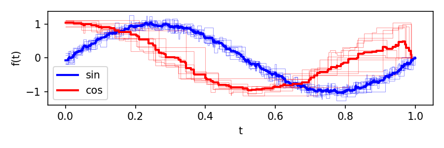

======================
Working with Tensors
======================

This guide covers the practical details of creating, manipulating, and persisting tensors in masspcf.

Creating tensors
================

Using zeros
-----------

The most common way to create a tensor is :py:func:`~masspcf.zeros`, which allocates a tensor of a given shape filled with "zero" elements::

   import masspcf as mpcf

   # 1-D tensor of 100 PCFs (32-bit, the default)
   X = mpcf.zeros((100,))

   # 3-D tensor of 64-bit PCFs
   Y = mpcf.zeros((4, 10, 25), dtype=mpcf.pcf64)

   # Scalar float tensor
   Z = mpcf.zeros((5, 5), dtype=mpcf.f64)

For PCF dtypes, "zero" is a function that is identically zero. For numeric dtypes, it is the number 0. For point cloud dtypes, it is an empty point cloud.

Generating random data
-----------------------

For quick experimentation, :py:mod:`masspcf.random` provides functions that generate tensors of noisy trigonometric PCFs::

   from masspcf.random import noisy_sin, noisy_cos

   # 200 noisy sin(2*pi*t) functions, each with 100 breakpoints
   sines = noisy_sin((200,), n_points=100)

   # 2-D: 10 x 50 noisy cosine functions with 30 breakpoints each
   cosines = noisy_cos((10, 50), n_points=30)

These functions return ``Pcf32Tensor`` by default. Pass ``dtype=mpcf.pcf64`` for 64-bit.

From serialized NumPy data
---------------------------

If you already have PCF data in NumPy arrays, :py:func:`~masspcf.from_serial_content` lets you construct a tensor from a flat content array and an enumeration array that describes how to split it::

   import numpy as np
   import masspcf as mpcf

   # Three PCFs packed into a single content array
   content = np.array([
       [0.0, 2.5], [1.5, 1.2], [3.14, 0.0],   # PCF 0 (3 points)
       [0.0, 7.0], [3.8, 5.5], [4.5, 1.5], [7.0, 0.0],  # PCF 1 (4 points)
       [0.0, 3.0], [2.0, 0.0],                   # PCF 2 (2 points)
   ])

   # Each row gives (start, end) indices into content
   enumeration = np.array([[0, 3], [3, 7], [7, 9]])

   F = mpcf.from_serial_content(content, enumeration)
   # F is a Pcf32Tensor of shape (3,)

The enumeration array can be multidimensional. If it has shape ``(n1, n2, ..., nk, 2)``, the resulting tensor has shape ``(n1, n2, ..., nk)``.

Indexing and slicing
====================

Tensors support NumPy-style indexing. The behavior depends on whether you index with integers or slices.

Single-element access
---------------------

Indexing with all integers returns the element at that position::

   X = mpcf.zeros((10, 5))
   f = X[3, 2]   # returns a Pcf object

For a ``Pcf32Tensor`` or ``Pcf64Tensor``, the returned element is a :py:class:`~masspcf.Pcf`. For a ``Float32Tensor``, it is a Python float. For a ``PointCloud32Tensor``, it is a ``Float32Tensor`` (representing the point cloud as a numeric array).

Slicing
-------

Using slices returns a tensor (view)::

   X = mpcf.zeros((10, 5, 4))

   row = X[3, :, :]          # shape (5, 4)
   sub = X[2:8, 1:, 2]       # shape (6, 4)
   every_other = X[::2, :, :]  # shape (5, 5, 4)

Views share the underlying data with the original tensor, so no data is copied.

Assignment
----------

You can assign into tensors using the same indexing syntax::

   from masspcf.random import noisy_sin, noisy_cos

   A = mpcf.zeros((2, 10))

   # Assign noisy sin functions into the first row
   A[0, :] = noisy_sin((10,), n_points=100)

   # Assign noisy cos functions into the second row
   A[1, :] = noisy_cos((10,), n_points=15)

You can also assign individual elements::

   f = mpcf.Pcf([[0, 1.0], [1, 2.0], [3, 0.0]])
   A[0, 0] = f

Shape and copying
-----------------

Every tensor has a :py:attr:`shape` property::

   X = mpcf.zeros((10, 5, 4))
   X.shape        # (10, 5, 4)
   X[3, :, :].shape  # (5, 4)

To create an independent copy (not a view)::

   Y = X.copy()

To collapse all dimensions into one::

   flat = X.flatten()  # shape (200,)

Reductions
==========

Reductions collapse a tensor along a specified dimension. The ``dim`` parameter
selects which axis to reduce over: every "slice" along that axis is combined
into a single output value.

How ``dim`` works
-----------------

Consider a 2-D tensor ``A`` of shape ``(m, n)``:

.. code-block:: text

   A = [ [ A[0,0]  A[0,1]  ...  A[0,n-1] ],       shape (m, n)
         [ A[1,0]  A[1,1]  ...  A[1,n-1] ],
           ...
         [ A[m-1,0] A[m-1,1] ... A[m-1,n-1] ] ]

**Reducing along dim=0** (the row axis) combines elements that share the same
column index. For each column ``j``, the elements ``A[0,j], A[1,j], ...,
A[m-1,j]`` are reduced together. The result has shape ``(n,)``::

   # result[j] = reduce(A[0,j], A[1,j], ..., A[m-1,j])
   result = mpcf.mean(A, dim=0)    # shape (n,)

**Reducing along dim=1** (the column axis) combines elements that share the same
row index. For each row ``i``, the elements ``A[i,0], A[i,1], ..., A[i,n-1]``
are reduced together. The result has shape ``(m,)``::

   # result[i] = reduce(A[i,0], A[i,1], ..., A[i,n-1])
   result = mpcf.mean(A, dim=1)    # shape (m,)

In general, for a tensor of shape ``(d_0, d_1, ..., d_k)``, reducing along
``dim=j`` produces a result of shape ``(d_0, ..., d_{j-1}, d_{j+1}, ..., d_k)``
-- the ``j``-th dimension is removed, and each position in the output
corresponds to the reduction of all elements along that axis.

When the result would be a single element (a tensor of shape ``(1,)``), masspcf
returns a scalar (a ``Pcf`` or a ``float``) directly rather than a 1-element
tensor.

mean
----

:py:func:`~masspcf.mean` computes the pointwise average of PCFs along a dimension::

   import masspcf as mpcf
   from masspcf.random import noisy_sin

   X = noisy_sin((50,), n_points=100)

   # Average all 50 functions into a single Pcf
   avg = mpcf.mean(X, dim=0)

For a higher-dimensional tensor, the specified dimension is collapsed::

   A = mpcf.zeros((3, 100))
   # ... fill A ...

   # Average across dim=1: result has shape (3,)
   row_means = mpcf.mean(A, dim=1)

   # Average across dim=0: result has shape (100,)
   col_means = mpcf.mean(A, dim=0)

max_time
--------

:py:func:`~masspcf.max_time` finds the maximum time value (the rightmost breakpoint) across PCFs along a dimension::

   t_max = mpcf.max_time(X, dim=0)

The result is a numeric value (or numeric tensor), not a PCF. This is useful for
aligning PCFs for plotting or further analysis.

Saving and loading
==================

masspcf provides a binary format for efficiently saving and loading tensors. All tensor types are supported, including PCF, numeric, point cloud, and barcode tensors.

Saving
------

Use :py:func:`~masspcf.save` to write a tensor to a file::

   import masspcf as mpcf
   from masspcf.random import noisy_sin

   X = noisy_sin((100,), n_points=50)
   mpcf.save(X, 'my_pcfs.mpcf')

You can also pass an open file object in binary write mode::

   with open('my_pcfs.mpcf', 'wb') as f:
       mpcf.save(X, f)

Loading
-------

Use :py:func:`~masspcf.load` to read a tensor back::

   X = mpcf.load('my_pcfs.mpcf')

The returned tensor will be of the same type and dtype as what was saved. As with ``save``, you can also pass an open file object::

   with open('my_pcfs.mpcf', 'rb') as f:
       X = mpcf.load(f)

Plotting
========

The :py:func:`~masspcf.plotting.plot` function provides a quick way to visualize PCFs using matplotlib::

   from masspcf.plotting import plot as plotpcf
   from masspcf.random import noisy_sin
   import matplotlib.pyplot as plt

   X = noisy_sin((5,), n_points=50)

   fig, ax = plt.subplots()

   # Plot individual PCFs
   for i in range(X.shape[0]):
       plotpcf(X[i], ax=ax, alpha=0.5)

   # Plot a 1-D tensor directly (plots all elements)
   plotpcf(X, ax=ax, auto_label=True)

   plt.show()

The ``plot`` function accepts any keyword arguments that matplotlib's ``step`` function does (``color``, ``linewidth``, ``alpha``, ``label``, etc.). When plotting a 1-D tensor with ``auto_label=True``, each PCF is automatically labeled as ``f0``, ``f1``, etc.

Combining it all
================

Here is a complete example that creates a tensor of noisy sine and cosine functions, computes their means, and plots the result::

   import masspcf as mpcf
   from masspcf.random import noisy_sin, noisy_cos
   from masspcf.plotting import plot as plotpcf
   import matplotlib.pyplot as plt

   M = 10
   A = mpcf.zeros((2, M))

   A[0, :] = noisy_sin((M,), n_points=100)
   A[1, :] = noisy_cos((M,), n_points=15)

   fig, ax = plt.subplots(figsize=(6, 2))

   # Plot individual noisy functions
   plotpcf(A[0, :], ax=ax, color='b', linewidth=0.5, alpha=0.4)
   plotpcf(A[1, :], ax=ax, color='r', linewidth=0.5, alpha=0.4)

   # Compute and plot means
   Aavg = mpcf.mean(A, dim=1)
   plotpcf(Aavg[0], ax=ax, color='b', linewidth=2, label='sin')
   plotpcf(Aavg[1], ax=ax, color='r', linewidth=2, label='cos')

   plt.xlabel('t')
   plt.ylabel('f(t)')
   plt.legend()
   plt.show()

