===========
Time Series
===========

A :py:class:`~masspcf.TimeSeries` wraps a piecewise constant function with
real-world time metadata, making it easy to work with sensor readings,
sampled signals, and other time-stamped data in the masspcf framework.

Evaluating outside the series domain (before the first sample or after the
last) returns ``NaN``.

Creating a time series
======================

From times and values
---------------------

Pass separate arrays of sample times and values::

   import numpy as np
   import masspcf as mpcf

   times = np.array([10.0, 12.0, 14.0, 16.0, 18.0])
   values = np.array([1.0, 3.0, 2.0, 4.0, 1.5])
   ts = mpcf.TimeSeries(times, values)
   ts.start_time  # 10.0

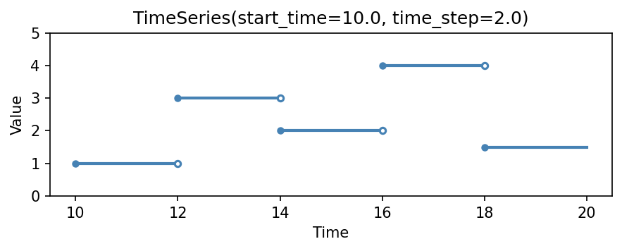

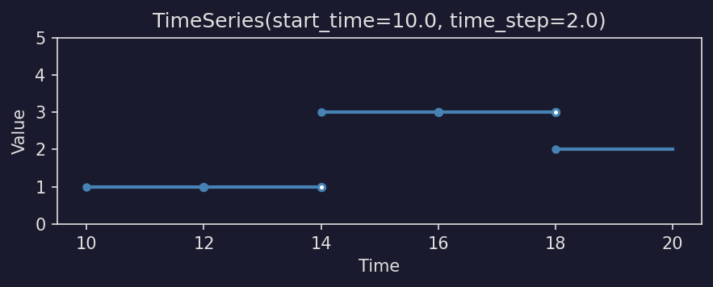

.. dropdown:: Show plotting code
   :color: secondary

   .. literalinclude:: _static/gen_timeseries_fig.py
      :pyobject: plot_timeseries_basic
      :language: python

From regularly-sampled values
-----------------------------

When samples are equally spaced, pass just the values with
``start_time`` and ``time_step``::

   ts = mpcf.TimeSeries(
       np.array([1.0, 3.0, 2.0, 4.0, 1.5]),
       start_time=10.0,
       time_step=2.0,
   )
   ts.times    # array([10., 12., 14., 16., 18.])
   ts.values   # array([1. , 3. , 2. , 4. , 1.5])

When using numeric (float) times, the default ``start_time`` is ``0.0``
and the default ``time_step`` is ``1.0``. Internally, float times are
interpreted as seconds since the Unix epoch (1970-01-01T00:00:00), which
is also how ``datetime64`` times are represented under the hood.

Datetime support
----------------

Both construction forms accept ``datetime64`` times. All numpy datetime64
units are supported, from attoseconds (``as``) through years (``Y``).
Pass ``datetime64`` arrays directly, or use ``start_time`` / ``time_step``
with ``datetime64`` / ``timedelta64``::

   # From datetime arrays
   times = np.array([
       "2024-06-15T08:00:00.000",
       "2024-06-15T08:00:00.010",
       "2024-06-15T08:00:00.020",
       "2024-06-15T08:00:00.030",
   ], dtype="datetime64[ms]")
   ts = mpcf.TimeSeries(times, np.array([22.1, 22.3, 23.0, 22.8]))

   # Or from regularly-sampled values
   ts = mpcf.TimeSeries(
       np.array([22.1, 22.3, 23.0, 22.8]),
       start_time=np.datetime64("2024-06-15T08:00:00"),
       time_step=np.timedelta64(10, "ms"),
   )

Query times can also be ``datetime64``::

   ts(np.datetime64("2024-06-15T08:00:00.015"))  # 23.0

Here is a more complete example with two datetime-based sensors that start at
different times and sample at different rates::

   epoch1 = np.datetime64("2024-06-15T08:00:00")
   epoch2 = np.datetime64("2024-06-15T08:00:02")

   ts1 = mpcf.TimeSeries(
       np.array([22.1, 22.3, 23.0, 22.8, 22.5, 23.2, 24.0, 23.5]),
       start_time=epoch1,
       time_step=np.timedelta64(500, "ms"),
   )
   ts2 = mpcf.TimeSeries(
       np.array([21.0, 21.8, 22.5, 23.1, 22.9]),
       start_time=epoch2,
       time_step=np.timedelta64(1, "s"),
   )

   # Query both at the same wall-clock time
   t = np.datetime64("2024-06-15T08:00:02.700")
   ts1(t)  # 23.2
   ts2(t)  # 21.0

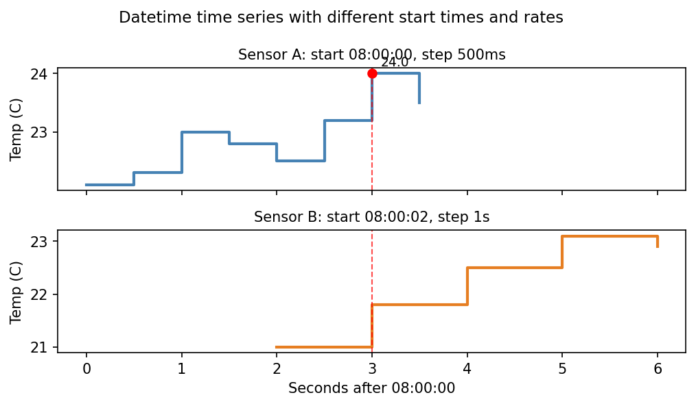

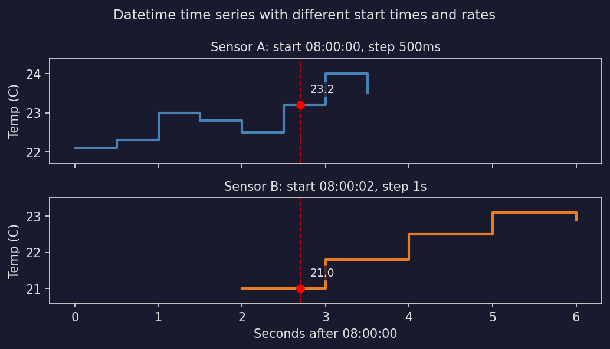

.. dropdown:: Show plotting code
   :color: secondary

   .. literalinclude:: _static/gen_timeseries_fig.py
      :pyobject: plot_datetime_example
      :language: python

Internally, all datetime values are converted to seconds since the Unix
epoch (1970-01-01T00:00:00). The ``start_time`` and ``times`` properties
return these float seconds. Fixed-length units (``as`` through ``W``) are
converted exactly via ``std::chrono``. For variable-length units (``M``
and ``Y``), absolute times are converted to true seconds since epoch; the
``time_step`` uses a conventional approximation of **1 month = 30 days**
and **1 year = 365.25 days**.

Multi-channel time series
=========================

When the data has multiple channels (e.g. a 3-axis accelerometer or
multi-sensor readings), pass a 2-D values array of shape
``(n_channels, n_times)``::

   # 2 channels (e.g. temperature + humidity), 3 time points
   times = np.array([0.0, 1.0, 2.0])
   values = np.array([
       [22.1, 22.5, 23.0],   # channel 0: temperature
       [45.0, 44.0, 43.5],   # channel 1: humidity
   ])
   ts = mpcf.TimeSeries(times, values)
   ts.n_channels  # 2

Evaluating at a single time returns one value per channel::

   ts(0.5)  # array([22.1, 45.0])

Evaluating at multiple times returns shape ``(n_channels, n_times)``::

   ts(np.array([0.5, 1.5]))
   # array([[22.1, 22.5],    # channel 0 at t=0.5, t=1.5
   #        [45.0, 44.0]])   # channel 1 at t=0.5, t=1.5

The regularly-sampled form also accepts 2-D values::

   values = np.array([[1.0, 2.0, 3.0], [10.0, 20.0, 30.0]])
   ts = mpcf.TimeSeries(values, start_time=0.0, time_step=0.5)
   ts.n_channels  # 2

Single-channel time series (1-D values) behave exactly as before --
scalar evaluation returns a float, array evaluation returns a 1-D array.

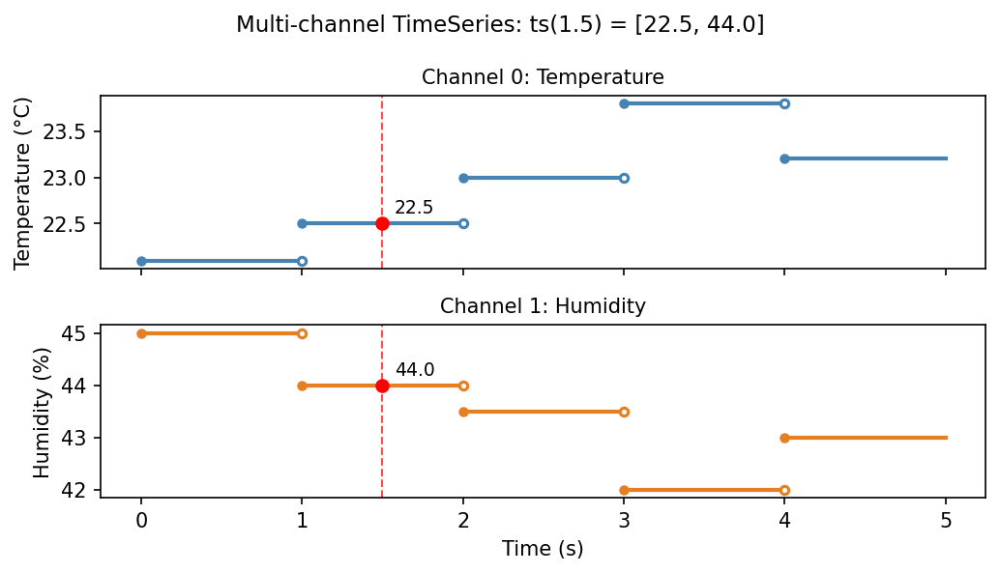

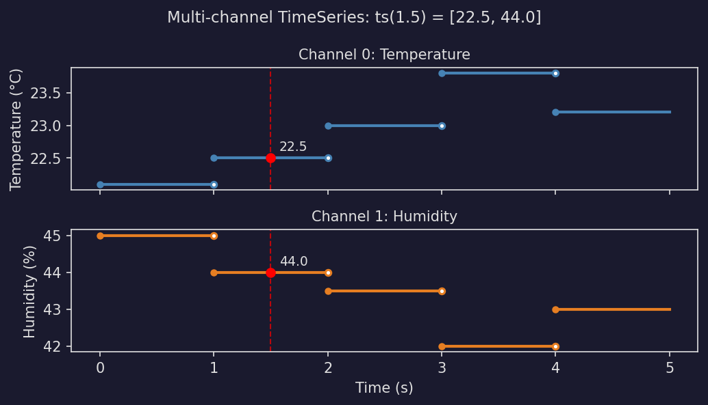

.. dropdown:: Show plotting code
   :color: secondary

   .. literalinclude:: _static/gen_timeseries_fig.py
      :pyobject: plot_multichannel
      :language: python

Evaluation
==========

Time series are callable. Pass a single time or an array of times::

   ts = mpcf.TimeSeries(np.array([1.0, 3.0, 2.0, 4.0, 1.5]),
                         start_time=10.0, time_step=2.0)

   ts(10.0)                       # 1.0
   ts(13.0)                       # 3.0
   ts(np.array([10.0, 14.0]))     # array([1.0, 2.0])

Times before the start or after the last sample return ``NaN``::

   ts(9.0)    # nan
   ts(20.0)   # nan

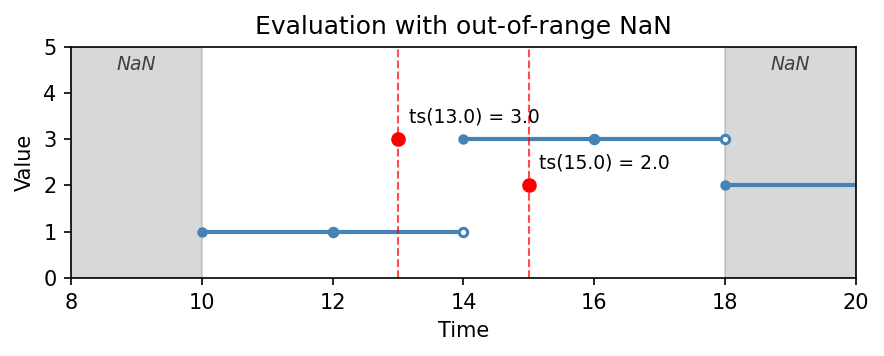

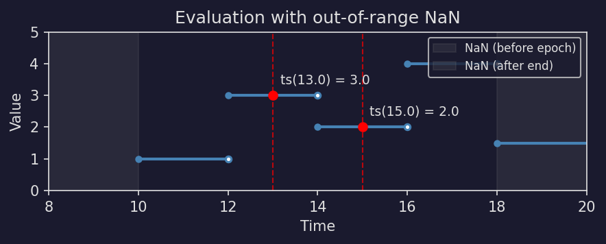

.. dropdown:: Show plotting code
   :color: secondary

   .. literalinclude:: _static/gen_timeseries_fig.py
      :pyobject: plot_timeseries_eval
      :language: python

Interpolation
=============

By default, a ``TimeSeries`` evaluates as a piecewise constant (step)
function: querying between breakpoints returns the value of the left
breakpoint.  The ``interpolation`` parameter controls this behavior:

``'nearest'`` (default)
   Step function — each sample holds its value until the next sample.

``'linear'``
   Linear interpolation between adjacent samples.

Set the mode at construction time or change it later::

   ts = mpcf.TimeSeries(
       np.array([1.0, 3.0, 2.0, 4.0, 1.5]),
       start_time=10.0, time_step=2.0,
       interpolation='linear',
   )
   ts(13.0)  # 2.5 (halfway between 3.0 and 2.0)

   # Change mode on an existing series
   ts.interpolation = 'nearest'
   ts(13.0)  # 3.0

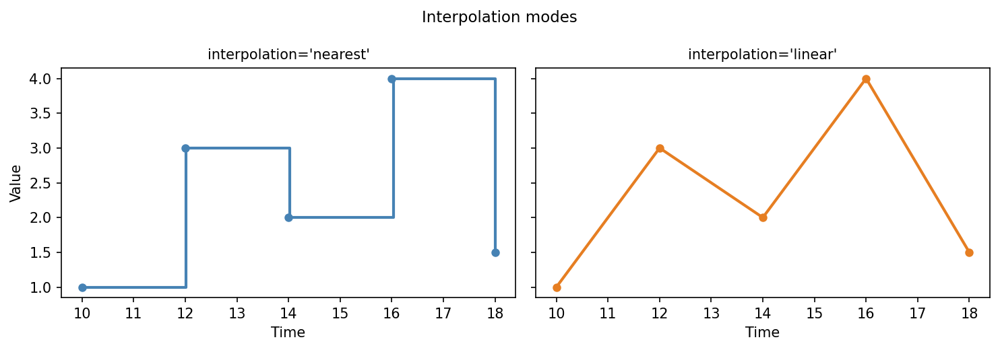

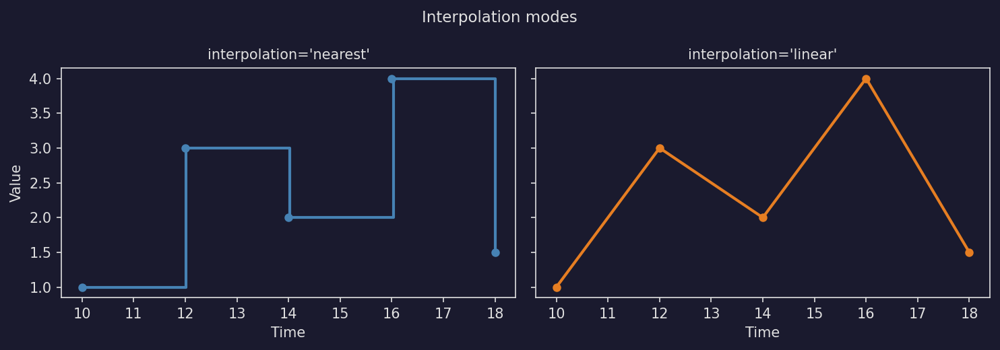

.. dropdown:: Show plotting code
   :color: secondary

   .. literalinclude:: _static/gen_timeseries_fig.py
      :pyobject: plot_interpolation
      :language: python

The interpolation mode is a property of the ``TimeSeries`` object, so
functions like :py:func:`~masspcf.embed_time_delay` automatically
respect it.  For example, a linear-interpolation embedding produces
smoother point clouds than a nearest-neighbor one.

Multi-channel time series interpolate each channel independently.

TimeSeriesTensor
================

A :py:class:`~masspcf.TimeSeriesTensor` holds a collection of time series.
Each series can have its own start time and sampling rate::

   # Fast sensor: 0.5s intervals, starts at t=1
   fast = mpcf.TimeSeries(
       np.array([2.1, 2.5, 3.0, 2.8, 2.3, 2.9, 3.2, 2.7, 2.4, 3.1]),
       start_time=1.0, time_step=0.5,
   )
   # Slow sensor: 1.5s intervals, starts at t=0
   slow = mpcf.TimeSeries(
       np.array([10.0, 12.0, 11.5, 13.0, 12.5]),
       start_time=0.0, time_step=1.5,
   )
   tensor = mpcf.TimeSeriesTensor([fast, slow])

   # Both evaluated at the same real time
   tensor(3.5)   # array([2.9, 12.0])

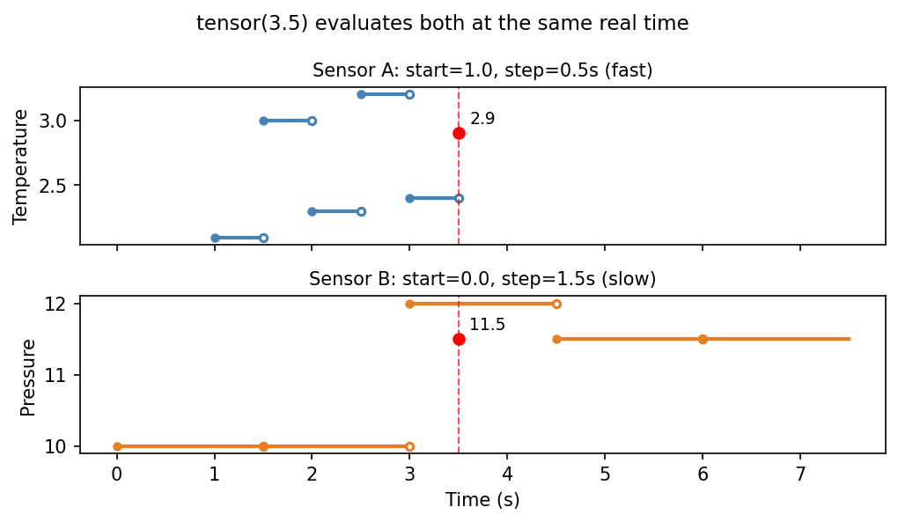

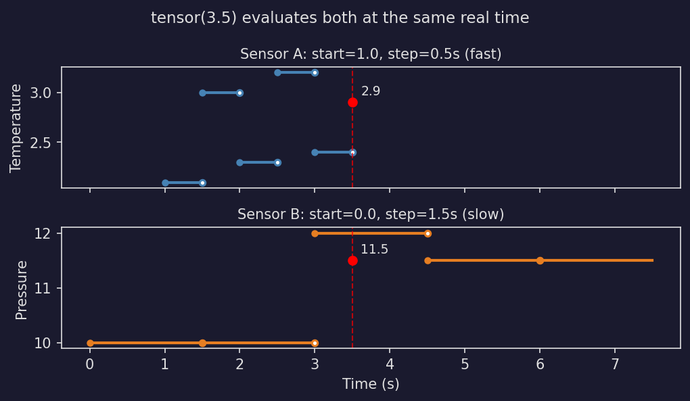

.. dropdown:: Show plotting code
   :color: secondary

   .. literalinclude:: _static/gen_timeseries_fig.py
      :pyobject: plot_different_scales
      :language: python

Evaluating a tensor queries every series at the given time. Series
where the query falls outside their domain return ``NaN``::

   tensor(0.5)
   # array([ 2.1,  nan])
   # fast: t=0.5 is before start (1.0) -> NaN... wait, 0.5 < 1.0 -> NaN
   # slow: t=0.5 is in [0, 1.5) -> 10.0

Array evaluation appends the time dimensions to the tensor shape, just like
PCF tensor evaluation::

   tensor(np.array([1.5, 3.5]))
   # shape (2, 2) -- tensor shape (2,) + times shape (2,)

The ``start_times`` and ``end_times`` properties give the time domain
of each series::

   tensor.start_times  # array([1. , 0. ])
   tensor.end_times    # array([5.5, 6. ])

Dtypes
======

Time series tensors use the ``ts32`` and ``ts64`` dtypes::

   ts = mpcf.TimeSeries(np.array([1.0], dtype=np.float32),
                         start_time=0.0, time_step=1.0)
   ts.dtype  # masspcf.ts32

   ts = mpcf.TimeSeries(np.array([1.0], dtype=np.float64),
                         start_time=0.0, time_step=1.0)
   ts.dtype  # masspcf.ts64

Use ``ts32`` for lower memory usage, ``ts64`` (the default) for higher
precision.

Interoperability
================

The ``TimeSeries`` constructor accepts NumPy arrays, so converting from
common data-science libraries is straightforward.

From a pandas Series
--------------------

A ``pandas.Series`` with a numeric or ``DatetimeIndex`` converts
directly::

   import pandas as pd
   import numpy as np
   import masspcf as mpcf

   # Numeric index
   s = pd.Series([1.0, 3.0, 2.0, 4.0], index=[0.0, 0.5, 1.0, 1.5])
   ts = mpcf.TimeSeries(s.index.to_numpy(), s.to_numpy())

   # DatetimeIndex -- pass the index as times
   idx = pd.date_range("2024-01-01", periods=100, freq="h")
   s = pd.Series(np.random.randn(100), index=idx)
   ts = mpcf.TimeSeries(s.index.to_numpy(), s.to_numpy())

This works for both regularly and irregularly sampled series -- the
``TimeSeries`` constructor infers the time step from the provided
times.

From a pandas DataFrame
-----------------------

Each column of a ``DataFrame`` can become a separate ``TimeSeries``.
Use a ``TimeSeriesTensor`` to group them::

   df = pd.DataFrame({
       "sensor_a": np.random.randn(100),
       "sensor_b": np.random.randn(100),
       "sensor_c": np.random.randn(100),
   }, index=pd.date_range("2024-01-01", periods=100, freq="min"))

   series = [
       mpcf.TimeSeries(df.index.to_numpy(), df[col].to_numpy())
       for col in df.columns
   ]
   tensor = mpcf.TimeSeriesTensor(series)

Alternatively, if the columns represent channels of the *same* signal,
pass the full array as a multi-channel ``TimeSeries``. Transpose the
DataFrame since ``TimeSeries`` expects ``(n_channels, n_times)``::

   ts = mpcf.TimeSeries(
       df.index.to_numpy(),
       df.to_numpy().T,   # (n_times, n_cols) -> (n_channels, n_times)
   )
   ts.n_channels  # 3

From a CSV file
---------------

Use pandas (or any CSV reader) to load the file, then convert::

   df = pd.read_csv("sensor_log.csv", parse_dates=["timestamp"])
   ts = mpcf.TimeSeries(
       df["timestamp"].to_numpy().astype("datetime64[s]"),
       df["value"].to_numpy(),
   )

From an xarray DataArray
------------------------

``xarray`` stores coordinates as NumPy arrays under the hood::

   import xarray as xr

   # 1-D DataArray with a time coordinate
   da = xr.DataArray(
       np.random.randn(200),
       dims=["time"],
       coords={"time": pd.date_range("2024-06-01", periods=200, freq="h")},
   )
   ts = mpcf.TimeSeries(
       da.coords["time"].values,   # datetime64 array
       da.values,
   )

From a polars DataFrame
-----------------------

Polars columns convert to NumPy via ``.to_numpy()``::

   import polars as pl

   df = pl.DataFrame({
       "timestamp": pl.datetime_range(
           datetime(2024, 1, 1), datetime(2024, 1, 2),
           interval="1h", eager=True,
       ),
       "value": np.random.randn(25),
   })
   ts = mpcf.TimeSeries(
       df["timestamp"].to_numpy().astype("datetime64[us]"),
       df["value"].to_numpy(),
   )

From an sktime dataset
----------------------

`sktime <https://www.sktime.net>`_ datasets are typically ``pandas.Series``
objects with a ``PeriodIndex``. Convert the index to timestamps first::

   from sktime.datasets import load_airline

   y = load_airline()                          # Series with PeriodIndex
   times = y.index.to_timestamp().to_numpy()   # -> datetime64 array
   ts = mpcf.TimeSeries(times, y.to_numpy().astype(float))

For a complete classification example using sktime's multi-channel
BasicMotions dataset, see the
:doc:`motion classification tutorial <tutorial_notebooks/motion_classification>`.

Time delay embedding
====================

Time delay embedding (also known as Takens embedding) reconstructs the
phase-space dynamics of a system from a single observed time series.
The function :py:func:`~masspcf.embed_time_delay` converts a ``TimeSeries``
(or ``TimeSeriesTensor``) into a :py:class:`~masspcf.PointCloudTensor`
whose points are delay vectors.

At each valid time *t*, the embedding vector looks backward:

.. math::

   \mathbf{v}(t) = \bigl[\, x(t - (d{-}1)\tau),\; \ldots,\; x(t - \tau),\; x(t) \,\bigr]

where *d* is the embedding ``dimension`` and :math:`\tau` is the ``delay``.
Valid times start at :math:`t_{\min} = t_0 + (d-1)\tau`, where
:math:`t_0` is the start of the series.

Basic usage
-----------

Pass a ``TimeSeries``, the embedding dimension, and the delay::

   import numpy as np
   import masspcf as mpcf

   np.random.seed(42)
   t = np.linspace(0, 4 * np.pi, 200)
   values = np.sin(t) + 0.1 * np.random.randn(len(t))
   ts = mpcf.TimeSeries(values, start_time=0.0, time_step=t[1] - t[0])

   cloud = mpcf.embed_time_delay(ts, dimension=2, delay=0.4)
   cloud.shape   # (1,)
   pts = np.asarray(cloud[0])
   pts.shape     # (n_points, 2)

The result is a :py:class:`~masspcf.PointCloudTensor`. Without windowing
the shape is ``(1,)`` — a single point cloud. Each row is a delay vector
of length ``dimension``.

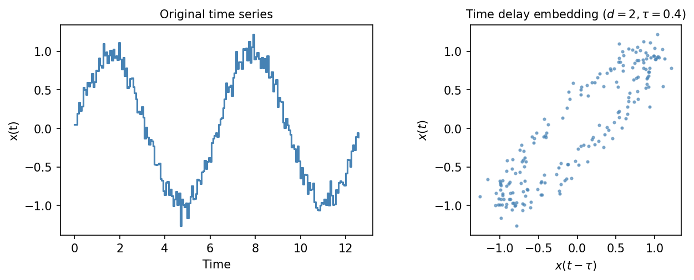

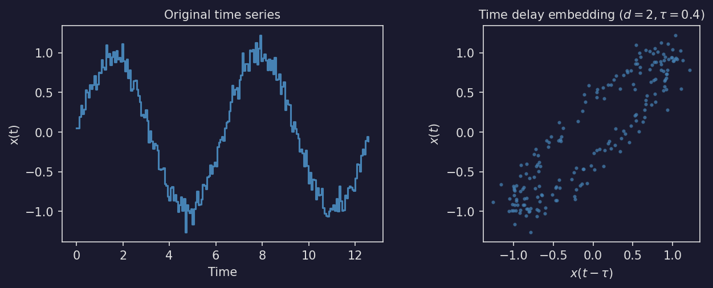

.. dropdown:: Show plotting code
   :color: secondary

   .. literalinclude:: _static/gen_timeseries_fig.py
      :pyobject: plot_embed_basic
      :language: python

Higher dimensions work the same way — the point dimension equals ``d``::

   cloud3d = mpcf.embed_time_delay(ts, dimension=3, delay=0.4)
   np.asarray(cloud3d[0]).shape  # (n_points, 3)

Multi-channel embedding
-----------------------

For a multi-channel ``TimeSeries`` with *c* channels, the delay vector
at time *t* interleaves the channels:

.. math::

   \mathbf{v}(t) = \bigl[\,
       x_1(t{-}(d{-}1)\tau),\; x_2(t{-}(d{-}1)\tau),\; \ldots,\;
       x_1(t),\; x_2(t)
   \,\bigr]

so each point has ``dimension * n_channels`` coordinates::

   times = np.arange(5, dtype=np.float64)
   values = np.array([
       [1.0, 2.0, 3.0, 4.0, 5.0],     # channel 0
       [10.0, 20.0, 30.0, 40.0, 50.0], # channel 1
   ])
   ts = mpcf.TimeSeries(times, values)
   cloud = mpcf.embed_time_delay(ts, dimension=2, delay=1.0)
   np.asarray(cloud[0]).shape  # (4, 4)  — 4 points, each 2*2 = 4D

Windowed embedding
------------------

The ``window`` parameter splits the valid time range into windows of the
given duration. This is useful for detecting changes in dynamics over
time — each window produces a separate point cloud that can be analyzed
independently::

   ts = mpcf.TimeSeries(np.arange(1.0, 11.0))
   clouds = mpcf.embed_time_delay(
       ts, dimension=2, delay=1.0, window=3.0)
   clouds.shape  # (3,) — three windows

Windows are anchored at the *end* of the valid range and extend backward,
so the first window may be shorter than ``window``.

Use ``stride`` to control overlap between windows. By default ``stride``
equals ``window`` (non-overlapping). A smaller stride produces overlapping
windows::

   clouds = mpcf.embed_time_delay(
       ts, dimension=2, delay=1.0, window=4.0, stride=2.0)
   clouds.shape  # (3,) — overlapping windows

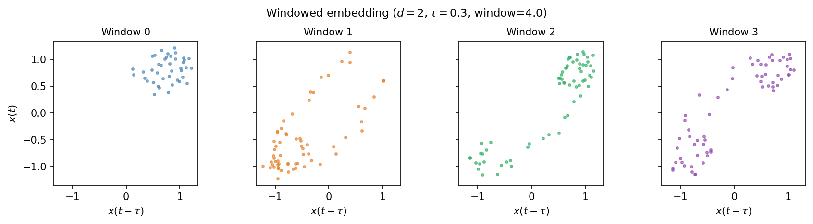

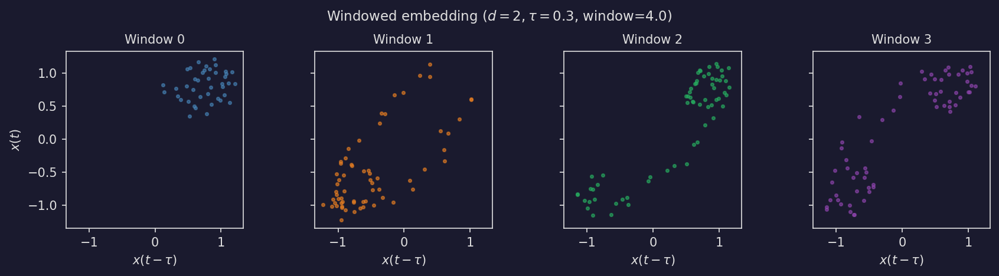

.. dropdown:: Show plotting code
   :color: secondary

   .. literalinclude:: _static/gen_timeseries_fig.py
      :pyobject: plot_embed_windowed
      :language: python

Embedding a TimeSeriesTensor
----------------------------

When applied to a ``TimeSeriesTensor`` of shape *S*, the result is a
``PointCloudTensor`` of shape *S* (without windowing) or
*S* + ``(n_windows,)`` (with windowing). Each series is embedded
independently::

   ts1 = mpcf.TimeSeries(np.arange(10, dtype=np.float64))
   ts2 = mpcf.TimeSeries(np.arange(10, dtype=np.float64) * 10)
   tensor = mpcf.TimeSeriesTensor([ts1, ts2])

   clouds = mpcf.embed_time_delay(tensor, dimension=2, delay=1.0)
   clouds.shape  # (2,)

   windowed = mpcf.embed_time_delay(
       tensor, dimension=2, delay=1.0, window=3.0)
   windowed.shape  # (2, n_windows)

Datetime delays
---------------

When the time series uses ``datetime64`` times, pass the delay as a
``timedelta64``::

   times = np.array([
       "2024-01-01T00:00:00",
       "2024-01-01T00:00:01",
       "2024-01-01T00:00:02",
       "2024-01-01T00:00:03",
       "2024-01-01T00:00:04",
   ], dtype="datetime64[s]")
   ts = mpcf.TimeSeries(times, np.array([1.0, 2.0, 3.0, 4.0, 5.0]))
   cloud = mpcf.embed_time_delay(
       ts, dimension=2, delay=np.timedelta64(1, 's'))

Connecting to TDA
-----------------

The point clouds produced by ``embed_time_delay`` integrate naturally
with masspcf's persistence pipeline. A typical workflow:

1. Embed a time series into a point cloud.
2. Compute persistent homology with
   :py:func:`~masspcf.persistence.compute_persistent_homology`.
3. Summarize with
   :py:func:`~masspcf.persistence.barcode_to_stable_rank` or
   :py:func:`~masspcf.persistence.barcode_to_betti_curve`.

::

   from masspcf.persistence import (
       compute_persistent_homology,
       barcode_to_stable_rank,
   )

   cloud = mpcf.embed_time_delay(ts, dimension=3, delay=0.5)
   barcodes = compute_persistent_homology(cloud, max_dim=1)
   sr = barcode_to_stable_rank(barcodes)

For a complete worked example — including windowed embedding and
topological regime-change detection — see the
:doc:`Lorenz attractor tutorial <tutorial_notebooks/lorenz_takens_embedding>`.
