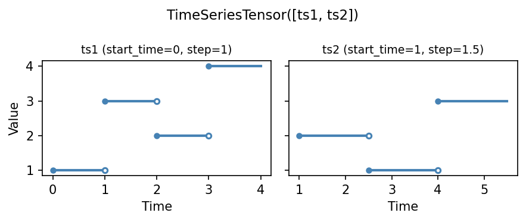
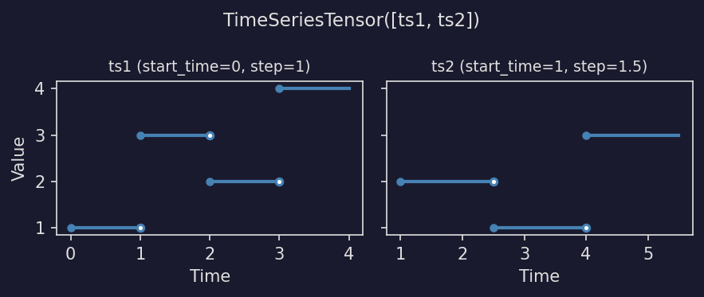

===========
Time Series
===========

A :py:class:`~masspcf.TimeSeries` wraps a piecewise constant function with
real-world time metadata, making it easy to work with sensor readings,
sampled signals, and other time-stamped data in the masspcf framework.

Each ``TimeSeries`` stores:

- A :py:class:`~masspcf.Pcf` holding the actual values.
- A **start_time** -- the real-world time corresponding to the start of the series.
- A **time_step** -- the real-world duration of each PCF time unit.

Internally, the conversion is:

.. math::

   t_{\text{pcf}} = \frac{t_{\text{real}} - \text{start time}}{\text{time step}}

Evaluating outside the series domain (before the start or after the last
breakpoint) returns ``NaN``.

Creating a time series
======================

From a 1-D array of values
--------------------------

The simplest construction: supply an array of values. Each value becomes one
step of the resulting piecewise constant function::

   import numpy as np
   import masspcf as mpcf

   # Five measurements taken every 2 seconds, starting at t=10
   ts = mpcf.TimeSeries(
       np.array([1.0, 3.0, 2.0, 4.0, 1.5]),
       start_time=10.0,
       time_step=2.0,
   )
   ts.times    # array([10., 12., 14., 16., 18.])
   ts.values   # array([1. , 3. , 2. , 4. , 1.5])

.. image:: _static/timeseries_basic_light.png
   :width: 80%
   :class: only-light
   :alt: A basic time series with start_time=10 and time_step=2

.. image:: _static/timeseries_basic_dark.png
   :width: 80%
   :class: only-dark
   :alt: A basic time series with start_time=10 and time_step=2

.. dropdown:: Show plotting code
   :color: secondary

   .. literalinclude:: _static/gen_timeseries_fig.py
      :pyobject: plot_timeseries_basic
      :language: python

From time-value pairs
---------------------

Pass an ``(n, 2)`` array where each row is a ``(time, value)`` pair. The
start_time is automatically inferred from the first time::

   data = np.array([
       [5.0, 100.0],
       [6.0, 200.0],
       [8.0, 300.0],
   ])
   ts = mpcf.TimeSeries(data, time_step=1.0)
   ts.start_time  # 5.0  (inferred from first time)
   ts.end_time    # 8.0

From an existing Pcf
--------------------

Wrap a :py:class:`~masspcf.Pcf` directly by supplying the time metadata::

   pcf = mpcf.Pcf(np.array([[0.0, 1.0], [1.0, 2.0], [3.0, 0.5]]))
   ts = mpcf.TimeSeries(pcf, start_time=10.0, time_step=2.0)
   ts(12.0)  # 2.0  (pcf_t = 1.0)

Datetime support
----------------

Use :class:`numpy.datetime64` for the start_time and :class:`numpy.timedelta64`
for the time step when working with real timestamps::

   start_time = np.datetime64("2024-06-15T08:00:00")
   step = np.timedelta64(10, "ms")   # 10 milliseconds

   readings = np.array([22.1, 22.3, 23.0, 22.8])
   ts = mpcf.TimeSeries(readings, start_time=start_time, time_step=step)

   ts.times
   # array(['2024-06-15T08:00:00.000', '2024-06-15T08:00:00.010',
   #        '2024-06-15T08:00:00.020', '2024-06-15T08:00:00.030'],
   #       dtype='datetime64[ms]')

Query times can also be ``datetime64``::

   ts(np.datetime64("2024-06-15T08:00:00.015"))  # 23.0

.. note::

   Datetime arithmetic is performed in the native resolution of the
   ``timedelta64`` step (e.g. milliseconds), avoiding the floating-point
   precision loss that would occur when converting large start_time values to
   seconds.

Here is a more complete example with two datetime-based sensors that start at
different times and sample at different rates::

   epoch1 = np.datetime64("2024-06-15T08:00:00")
   epoch2 = np.datetime64("2024-06-15T08:00:02")

   ts1 = mpcf.TimeSeries(
       np.array([22.1, 22.3, 23.0, 22.8, 22.5, 23.2, 24.0, 23.5]),
       start_time=epoch1,
       time_step=np.timedelta64(500, "ms"),
   )
   ts2 = mpcf.TimeSeries(
       np.array([21.0, 21.8, 22.5, 23.1, 22.9]),
       start_time=epoch2,
       time_step=np.timedelta64(1, "s"),
   )

   # Query both at the same wall-clock time
   t = np.datetime64("2024-06-15T08:00:03")
   ts1(t)  # 23.2
   ts2(t)  # 21.8

.. image:: _static/timeseries_datetime_light.png
   :width: 90%
   :class: only-light
   :alt: Two datetime time series with different start times and sampling rates

.. image:: _static/timeseries_datetime_dark.png
   :width: 90%
   :class: only-dark
   :alt: Two datetime time series with different start times and sampling rates

.. dropdown:: Show plotting code
   :color: secondary

   .. literalinclude:: _static/gen_timeseries_fig.py
      :pyobject: plot_datetime_example
      :language: python

Evaluation
==========

Time series are callable. Pass a single time or an array of times::

   ts = mpcf.TimeSeries(np.array([1.0, 3.0, 2.0, 4.0, 1.5]),
                         start_time=10.0, time_step=2.0)

   ts(10.0)                       # 1.0 (at the start_time)
   ts(13.0)                       # 3.0 (in the second interval)
   ts(np.array([10.0, 14.0]))     # array([1.0, 2.0])

Out-of-range evaluation
-----------------------

Times before the start or after the last breakpoint return ``NaN``::

   ts(9.0)    # nan  (before start_time)
   ts(20.0)   # nan  (after end_time)

.. image:: _static/timeseries_eval_light.png
   :width: 80%
   :class: only-light
   :alt: Time series evaluation with NaN for out-of-range times

.. image:: _static/timeseries_eval_dark.png
   :width: 80%
   :class: only-dark
   :alt: Time series evaluation with NaN for out-of-range times

.. dropdown:: Show plotting code
   :color: secondary

   .. literalinclude:: _static/gen_timeseries_fig.py
      :pyobject: plot_timeseries_eval
      :language: python

TimeSeriesTensor
================

A :py:class:`~masspcf.TimeSeriesTensor` holds a collection of time series,
each with its own start_time and time step. This allows series sampled at
different rates or starting at different times to coexist in one tensor::

   ts1 = mpcf.TimeSeries(np.array([1.0, 3.0, 2.0, 4.0]),
                          start_time=0.0, time_step=1.0)
   ts2 = mpcf.TimeSeries(np.array([2.0, 1.0, 3.0]),
                          start_time=1.0, time_step=1.5)

   tensor = mpcf.TimeSeriesTensor([ts1, ts2])
   tensor.shape  # (2,)

.. dropdown:: Show plotting code
   :color: secondary

   .. literalinclude:: _static/gen_timeseries_fig.py
      :pyobject: plot_timeseries_tensor
      :language: python

Different scales and start times
--------------------------------

A common scenario: sensors sampling at different rates, coming online at
different times. Each ``TimeSeries`` carries its own ``start_time`` and
``time_step``, so they can all live in the same tensor::

   import numpy as np
   import masspcf as mpcf

   # Fast sensor: 0.5s intervals, starts at t=1
   fast = mpcf.TimeSeries(
       np.array([2.1, 2.5, 3.0, 2.8, 2.3, 2.9, 3.2, 2.7, 2.4, 3.1]),
       start_time=1.0, time_step=0.5,
   )
   # Slow sensor: 1.5s intervals, starts at t=0
   slow = mpcf.TimeSeries(
       np.array([10.0, 12.0, 11.5, 13.0, 12.5]),
       start_time=0.0, time_step=1.5,
   )
   tensor = mpcf.TimeSeriesTensor([fast, slow])

   # Both evaluated at the same real time
   tensor(3.5)   # array([2.9, 12.0])

.. image:: _static/timeseries_different_scales_light.png
   :width: 90%
   :class: only-light
   :alt: Two sensors with different sampling rates evaluated at the same time

.. image:: _static/timeseries_different_scales_dark.png
   :width: 90%
   :class: only-dark
   :alt: Two sensors with different sampling rates evaluated at the same time

.. dropdown:: Show plotting code
   :color: secondary

   .. literalinclude:: _static/gen_timeseries_fig.py
      :pyobject: plot_different_scales
      :language: python

Tensor evaluation
-----------------

Evaluating a ``TimeSeriesTensor`` queries every series at the given time.
Each series converts the query time using its own start_time and time step::

   tensor(0.5)
   # array([1., nan])
   # ts1: pcf_t = 0.5 -> 1.0
   # ts2: pcf_t = (0.5 - 1.0) / 1.5 < 0 -> NaN

   tensor(2.0)
   # array([3., 1.])
   # ts1: pcf_t = 2.0 -> 3.0 (third value)
   # ts2: pcf_t = (2.0 - 1.0) / 1.5 = 0.67 -> 2.0 (first value)

Array evaluation appends the time dimensions to the tensor shape, just like
PCF tensor evaluation::

   tensor(np.array([0.5, 2.0]))
   # shape (2, 2) -- tensor shape (2,) + times shape (2,)

Slicing
-------

Indexing a ``TimeSeriesTensor`` returns a ``TimeSeries`` (scalar index) or
a ``TimeSeriesTensor`` (slice)::

   tensor[0]      # TimeSeries (ts1)
   tensor[0:2]    # TimeSeriesTensor of shape (2,)

Properties
----------

Inspect the time domains of all series in the tensor::

   tensor.start_times  # array([0., 1.])
   tensor.end_times    # array([3. , 4. ])

Dtypes
======

Time series tensors use the ``ts32`` and ``ts64`` dtypes::

   ts = mpcf.TimeSeries(np.array([1.0], dtype=np.float32))
   ts.dtype  # masspcf.ts32

   ts = mpcf.TimeSeries(np.array([1.0], dtype=np.float64))
   ts.dtype  # masspcf.ts64

Use ``ts32`` for lower memory usage, ``ts64`` (the default) for higher
precision.
